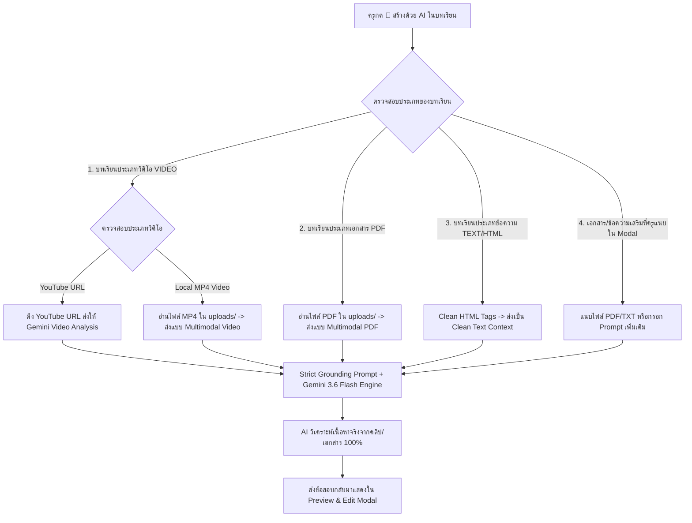

# แผนการปรับปรุงระบบ AI Quiz Generator ให้รองรับทั้ง คลิปวิดีโอ (Video), เอกสาร PDF และเนื้อหาบทเรียน (Multimodal Video & Document Grounding)

## 1. การรองรับคลิปวิดีโอ (Video Support Architecture)

ในระบบ TUNorth-Hub บทเรียนประเภทวิดีโอ (`ContentType == "VIDEO"`) มี 2 รูปแบบหลัก:

1. **วิดีโอ YouTube (`youtube.com` / `youtu.be`):**
   - Google Gemini มีความสามารถในการประมวลผลและเข้าใจเนื้อหาวิดีโอจาก YouTube URL โดยตรง (Gemini YouTube Multimodal Analysis)
   - ระบบจะส่ง YouTube URL ให้ Gemini วิเคราะห์เนื้อหา เสียงบรรยาย และหัวข้อในคลิปเพื่อนำมาออกข้อสอบ
2. **ไฟล์วิดีโอที่อัปโหลดในระบบ (`/uploads/videos/...` เช่น `.mp4`, `.webm`):**
   - สำหรับไฟล์วิดีโอขนาดไม่เกิน 20MB: ส่งเป็น Multimodal Video (`inlineData` ด้วย `mimeType: "video/mp4"`)
   - ระบบตรวจสอบไฟล์วิดีโอในเครื่องเซิร์ฟเวอร์ และดึงข้อมูลส่งให้ Gemini ประมวลผลภาพและเสียงของวิดีโอ
3. **คำบรรยาย / สรุปสาระสำคัญของวิดีโอ:**
   - หากครูมีข้อความสรุปคลิป หรือคำอธิบายประกอบวิดีโอ (`lesson.BodyText`) ระบบจะดึงมารวมกับข้อมูลวิดีโอเพื่อความแม่นยำ 100%

---

## 2. แผนภาพการทำงานของระบบ (Comprehensive Multimodal Flow)

---

## 3. รายการเช็กลิสต์การพัฒนา (Implementation Checklists)

### 📌 หมวดที่ 1: Backend Video & Document Processing (`ai_quiz_generator.go`)
- [x] 1.1 **รองรับวิดีโอ YouTube:** ตรวจสอบ `lesson.VideoURL` หากเป็น YouTube URL ให้ส่งเป็น Video Source Link พร้อมคำสั่งเฉพาะให้ Gemini วิเคราะห์เนื้อหาวิดีโอ
- [x] 1.2 **รองรับไฟล์วิดีโอในเครื่อง (Local MP4/WebM):** ตรวจสอบไฟล์ในโฟลเดอร์ `uploads/` และแปลงเป็น Base64 Multimodal Payload สำหรับวิดีโอ
- [x] 1.3 **รองรับไฟล์เอกสาร PDF (Local PDF):** อ่านไฟล์ `lesson.PDFURL` และส่งเป็น Base64 Multimodal PDF ให้ Gemini อ่านเอกสารทั้งเล่ม
- [x] 1.4 **รองรับการแนบไฟล์เอกสารเสริมจากคำขอ (Direct File Upload):** รองรับไฟล์ PDF/TXT ที่ครูอัปโหลดเพิ่มผ่านหน้า Modal
- [x] 1.5 **HTML Tag Sanitization:** กรองและทำความสะอาด HTML จาก `lesson.BodyText` ให้เป็นข้อความที่อ่านง่าย
- [x] 1.6 **Strict Grounding System Prompt:** กำหนดกฎเหล็กให้ AI ต้องออกข้อสอบจากเนื้อหาในคลิป/เอกสารเท่านั้น พร้อมระบุที่มาในคำอธิบายเฉลย (`explanation`)

### 📌 หมวดที่ 2: Backend Handlers & Routing (`quizzes.go`)
- [x] 2.1 ปรับปรุง `GenerateAIQuiz` ให้รองรับทั้ง JSON Payload และ Multipart Form Data สำหรับการแนบไฟล์เสริม
- [x] 2.2 ตรวจสอบความถูกต้องและขนาดไฟล์ (PDF สูงสุด 20MB, Video สูงสุด 25MB)

### 📌 หมวดที่ 3: Frontend UI Enhancements (`quiz-builder-modal.tsx`)
- [x] 3.1 เพิ่มป้ายแสดง **แหล่งข้อมูลที่ตรวจพบในบทเรียน (Detected Content Sources)** ใน `AIQuizGenerateModal`:
  - 🎥 กรณีเป็นวิดีโอ: แสดงป้าย `ตรวจพบวิดีโอ: [ชื่อคลิป/ลิงก์] (พร้อมวิเคราะห์เนื้อหาวิดีโอ)`
  - 📄 กรณีเป็น PDF: แสดงป้าย `ตรวจพบเอกสารสไลด์ PDF: [ชื่อไฟล์] (พร้อมดึงเนื้อหาทั้งเล่ม)`
  - 📝 กรณีเป็น Text: แสดงป้าย `ตรวจพบเนื้อหาบทความ: [ความยาวตัวอักษร] ตัวอักษร`
- [x] 3.2 ช่องอัปโหลดไฟล์เสริมและระบุคำสั่งพิเศษเพิ่มเติม
- [x] 3.3 แสดงสถานะการประมวลผลขณะวิเคราะห์คลิป/เอกสาร

### 📌 หมวดที่ 4: การตรวจสอบและการทดสอบ (Verification & Testing)
- [ ] 4.1 ทดสอบสร้างข้อสอบจากบทเรียนที่เป็นคลิปวิดีโอ YouTube
- [ ] 4.2 ทดสอบสร้างข้อสอบจากบทเรียนที่เป็นไฟล์วิดีโอ MP4 ในเครื่อง
- [ ] 4.3 ทดสอบสร้างข้อสอบจากบทเรียนที่เป็นไฟล์เอกสาร PDF
- [ ] 4.4 ทดสอบสร้างข้อสอบจากบทเรียนข้อความ Text/HTML
- [x] 4.5 รัน Automated Unit Tests (`go test -v ./...` และ `bun run build`) ผ่าน 100%
