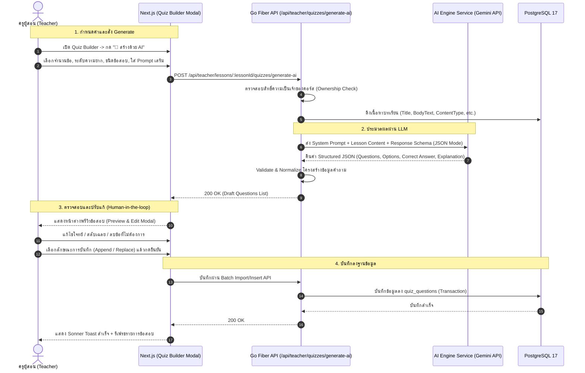

# 📋 แผนการพัฒนา: ระบบสร้างแบบทดสอบอัตโนมัติด้วย AI (AI Quiz Generator Engine)

เอกสารฉบับนี้วิเคราะห์ความเป็นไปได้ ผลกระทบต่อระบบ แหล่งข้อมูลเนื้อหา สถาปัตยกรรม API รูปแบบ JSON Schema และรายการงานย่อย (Implementation Checklist) สำหรับการพัฒนาระบบสร้างแบบทดสอบอัตโนมัติด้วย AI (AI Quiz Generator Engine) จากเนื้อหาบทเรียนในแพลตฟอร์ม **TUNorth-Hub**

---

## 1. บทนำและวัตถุประสงค์ (Overview & Objectives)

ระบบสร้างแบบทดสอบอัตโนมัติด้วย AI ออกแบบมาเพื่อยกระดับการจัดการเรียนรู้ของครูผู้สอน ลดภาระและระยะเวลาในการคิดและพิมพ์โจทย์ข้อสอบ โดยมีเป้าหมายหลักคือ:
1. **การสร้างข้อสอบจากเนื้อหาบทเรียนอัตโนมัติ (Automated Content-Driven Quiz Generation):** ดึงเนื้อหาจากบทเรียน (`TEXT`, `CODE_LAB`, `SLIDE_PDF`, หรือคำอธิบายบทเรียน) แล้วให้ AI (Google Gemini 1.5/2.0 API) สรุปและสร้างเป็นชุดข้อสอบที่ตรงตามหลักสูตร
2. **ความยืดหยุ่นในการปรับแต่ง (Customizable Generation Parameters):** ครูผู้สอนสามารถเลือกจำนวนข้อ (เช่น 3, 5, 10, 15, 20 ข้อ), ระดับความยาก (ง่าย / ปานกลาง / ท้าทาย), ประเภทคำถาม (ปรนัย 4 ตัวเลือก หรือ ถูก/ผิด) และใส่คำสั่งพิเศษเพิ่มเติม (Custom Prompt)
3. **การตรวจสอบและควบคุมโดยครูผู้สอน (Human-in-the-Loop Architecture):** ข้อสอบที่ AI สร้างขึ้นจะแสดงในหน้า Preview ให้ครูสามารถตรวจสอบ ปรับแก้โจทย์ ตัวเลือก เฉลย หรือลบข้อที่ไม่ต้องการออก ก่อนกดยืนยันบันทึก
4. **ความยืดหยุ่นในการบันทึกข้อมูล (Append & Replace Modes):** บันทึกข้อสอบใหม่เพิ่มต่อท้าย (Append) หรือแทนที่ข้อสอบเดิมทั้งหมด (Replace) ผ่านระบบ Batch Transaction เดิมที่มีความเสถียรสูง

---

## 2. การวิเคราะห์ผลกระทบต่อระบบ (System Impact Analysis)

| มิติ / ส่วนประกอบ (Component) | ระดับผลกระทบ | รายละเอียดผลกระทบและแนวทางรับมือ |
| :--- | :---: | :--- |
| **1. ฐานข้อมูล (Database Schema)** | **ไม่มีผลกระทบ (0% Breaking)** | ตาราง `quizzes` และ `quiz_questions` มีโครงสร้างรองรับประเภทคำถาม (`MULTIPLE_CHOICE`, `TRUE_FALSE`), `options_json`, `correct_answer`, `points` อยู่แล้ว ไม่ต้อง Migrate ตารางข้อสอบใหม่ |
| **2. ความถูกต้องทางการศึกษา (Pedagogical Accuracy & Hallucination)** | **ควบคุมได้ 100% (Medium Risk mitigated by Design)** | ป้องกันปัญหา AI หลอนหรือเฉลยผิดพลาด โดยการบังคับกระบวนการ **Human-in-the-loop**: ระบบจะไม่บันทึกข้อสอบลง Database ทันที แต่จะส่งผลลัพธ์เป็น Draft ให้ครูพรีวิวและปรับแก้ก่อนเสมอ |
| **3. ประสิทธิภาพและ Latency (System Performance)** | **ต่ำ-ปานกลาง (Low-Medium)** | การเรียก LLM มีเวลาประมวลผลประมาณ 3–8 วินาที ออกแบบโดยใช้ Asynchronous Request, กำหนด Context Timeout 30–60 วินาที พร้อมแสดง Animated Loading State บน UI |
| **4. สิทธิ์และความปลอดภัย (RBAC & Key Security)** | **ควบคุมได้รัดกุม** | เก็บ API Key ไว้ฝั่ง Go Backend เท่านั้น (`SystemSettings` หมวด `AI` หรือ `.env`), ไม่เปิดเผย Key ให้ Frontend, และมี Teacher Ownership Guard อนุญาตเฉพาะครูเจ้าของคอร์สหรือ Admin |
| **5. ค่าใช้จ่ายและโควตา (Cost & API Quota)** | **ต่ำมาก (Very Low)** | Gemini 1.5 Flash API มี Free Tier และ Paid Tier ราคาประหยัด พร้อมเพิ่ม Rate Limit และ Token Budget ป้องกันการส่ง Request ถี่เกินไป |

---

## 3. สถาปัตยกรรมและกระบวนการทำงาน (Architecture & Workflow)

### 3.1 แผนภาพการทำงานของระบบ (Workflow Diagram)



---

## 4. โครงสร้างข้อมูลและสเปกของ API (Data Specification & API Contracts)

### 4.1 Request Payload (`POST /api/teacher/lessons/:lessonId/quizzes/generate-ai`)

```json
{
  "question_count": 5,
  "difficulty": "MEDIUM",
  "question_type": "MULTIPLE_CHOICE",
  "custom_instructions": "เน้นการคิดวิเคราะห์และการประยุกต์ใช้โค้ด",
  "include_lesson_text": true,
  "custom_context": ""
}
```

### 4.2 Gemini Response Schema (Enforced Structured JSON)

```json
{
  "quiz_title": "แบบทดสอบท้ายบทเรียน: ตัวแปรและชนิดข้อมูลใน Python",
  "questions": [
    {
      "question_text": "คำสั่งใดใน Python ที่ใช้สำหรับตรวจสอบชนิดข้อมูลของตัวแปร?",
      "question_type": "MULTIPLE_CHOICE",
      "options": [
        "type()",
        "typeof()",
        "datatype()",
        "check()"
      ],
      "correct_answer": "type()",
      "points": 1,
      "explanation": "ฟังก์ชัน type() ในภาษา Python ใช้สำหรับส่งคืนประเภทข้อมูลของอ็อบเจกต์"
    }
  ]
}
```

---

## 5. รายการงานย่อยและเช็กลิสต์การพัฒนา (Implementation Checklists)

### 📌 หมวดที่ 1: การตั้งค่าระบบและการจัดการคีย์ (System Settings & Config Management)
- [x] 1.1 เพิ่มคีย์การตั้งค่า AI ใน `backend/internal/models/models.go` / `SystemSettings` (เช่น `ai_provider`, `ai_gemini_api_key`, `ai_default_model`, `ai_enabled`)
- [x] 1.2 เพิ่ม Default Seed Settings สำหรับ AI Config ใน `backend/internal/seed/seed.go`
- [x] 1.3 อัปเดตหน้าจัดการตั้งค่าระบบฝั่ง Admin (`/admin/settings`) เพิ่มหมวดหมู่ AI Settings หรือแท็บการตั้งค่า AI (กรอก API Key และทดสอบการเชื่อมต่อ)
- [x] 1.4 อัปเดตไฟล์ `.env.example` เพื่อรองรับ `GEMINI_API_KEY`

### 📌 หมวดที่ 2: บริการ AI Engine และการประมวลผลข้อสอบ (Go AI Quiz Generator Service)
- [x] 2.1 สร้างไฟล์ `backend/internal/services/ai_quiz_generator.go`
- [x] 2.2 พัฒนาระบบ Client เชื่อมต่อ Gemini Interactions REST API (พร้อม Header, API Key, Model Selection เช่น `gemini-3.6-flash`)
- [x] 2.3 ออกแบบ System Prompt และ Context Builder สำหรับดึงเนื้อหาจาก `Lesson` (`body_text`, `title`, โมดูล, คอร์ส)
- [x] 2.4 รองรับการตั้งค่าความยาก (EASY, MEDIUM, HARD) และประเภทข้อสอบ (MULTIPLE_CHOICE, TRUE_FALSE, MIXED)
- [x] 2.5 พัฒนาระบบ Validation & Normalization สำหรับคำถามที่ได้รับจาก AI (ตรวจสอบจำนวนตัวเลือก, เฉลยต้องตรงกับตัวเลือกอย่างน้อย 1 ข้อ, ป้องกันค่าว่าง)
- [x] 2.6 พัฒนาระบบ Fallback และ Error Handling กรณี AI Quota เต็ม หรือ Timeout

### 📌 หมวดที่ 3: Backend Handlers & Routing (API Endpoints Integration)
- [x] 3.1 เพิ่มฟังก์ชัน Handler `GenerateAIQuiz(c *fiber.Ctx) error` และ `BatchCreateQuestions` ใน `backend/internal/handlers/quizzes.go`
- [x] 3.2 ตรวจสอบสิทธิ์การเข้าถึง (RBAC): สิทธิ์ `TEACHER` หรือ `ADMIN` พร้อมตรวจ Course Ownership Guard
- [x] 3.3 ลงทะเบียน Route `POST /api/teacher/lessons/:lessonId/quizzes/generate-ai` และ `POST /api/teacher/quizzes/:quizId/questions/batch` ใน `backend/internal/routes/routes.go`
- [x] 3.4 เขียน Unit Test ใน `backend/internal/services/ai_quiz_generator_test.go` และ `backend/internal/handlers/quiz_import_test.go`

### 📌 หมวดที่ 4: ส่วนติดต่อผู้ใช้งานและการปรับแต่ง (Frontend Next.js 16 & UI Components)
- [x] 4.1 เพิ่มปุ่ม **"🤖 สร้างด้วย AI (AI Generator)"** บนแถบเครื่องมือใน [`QuizBuilderModal`](frontend/src/components/quiz-builder-modal.tsx)
- [x] 4.2 สร้างคอมโพเนนต์ Modal ตั้งค่าการสร้าง (`AIQuizGenerateModal`):
  - ตัวเลือกจำนวนข้อ (3, 5, 10, 15, 20)
  - ตัวเลือกระดับความยาก (ง่าย, ปานกลาง, ท้าทาย)
  - ตัวเลือกประเภทข้อสอบ (ปรนัย 4 ตัวเลือก, ถูก/ผิด, ผสมผสาน)
  - กล่องข้อความสำหรับระบุคำสั่งเสริม (Prompt เพิ่มเติม) และบริบทเสริม
- [x] 4.3 สร้างหน้าต่างแสดงตัวอย่างและแก้ไขข้อสอบที่ AI สร้างขึ้นก่อนบันทึก (`AIQuizPreviewModal`):
  - แสดงรายการโจทย์ ตัวเลือก และเฉลย พร้อม Badge ระบุระดับความยาก
  - รองรับการแก้ไขโจทย์ ตัวเลือก และเปลี่ยนคำตอบที่ถูกต้องได้ทันที
  - รองรับการลบข้อที่ไม่ต้องการออก และเพิ่มข้อใหม่
  - ตัวเลือกบันทึกแบบ **"เพิ่มต่อท้าย (Append)"** หรือ **"แทนที่ทั้งหมด (Replace)"**
- [x] 4.4 จัดการสถานะการโหลด (Loading Animation & Progress States) พร้อมการแจ้งเตือนด้วย **Sonner Toast**
- [x] 4.5 รีเฟรชรายการข้อสอบใน `QuizBuilderModal` อัตโนมัติเมื่อกดยืนยันบันทึก

### 📌 หมวดที่ 5: การตรวจสอบ ความถูกต้อง และการทดสอบระบบ (Verification & Testing)
- [x] 5.1 ทดสอบสร้างข้อสอบจากบทเรียนประเภทข้อความ (TEXT) ความยาวต่างๆ
- [x] 5.2 ทดสอบสร้างข้อสอบจากบทเรียนประเภทโค้ด (CODE_LAB)
- [x] 5.3 ทดสอบการระบุเงื่อนไขความยากและประเภทคำถาม (MULTIPLE_CHOICE, TRUE_FALSE, MIXED)
- [x] 5.4 ทดสอบโหมด Append (เพิ่มต่อท้าย) และ Replace (แทนที่ทั้งหมด)
- [x] 5.5 ทดสอบกรณีไม่มี API Key หรือ AI เกิด Timeout (แสดงข้อความแจ้งเตือนที่เข้าใจง่าย)
- [x] 5.6 ทดสอบการทำข้อสอบฝั่งนักเรียน (`QuizPlayer`) ว่าสามารถโหลดและตรวจคะแนนข้อสอบที่สร้างโดย AI ได้ถูกต้อง 100%
- [x] 5.7 อัปเดตรายการ Checklist ใน [`docs/spec.md`](docs/spec.md) และ [`gemini.md`](gemini.md)
