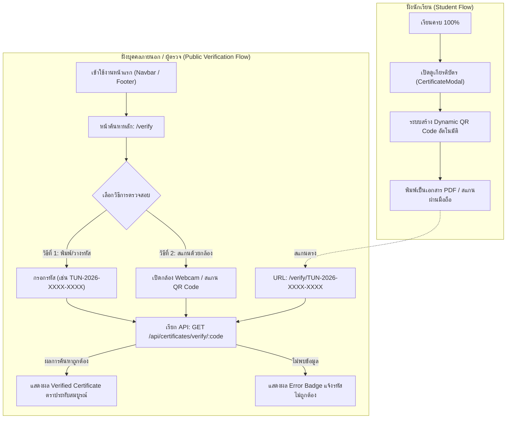

# 📜 Implementation Plan: ระบบตรวจสอบเกียรติบัตรและ Dynamic QR Code (Certificate Verification System Enhancement)

> **TUNorth-Hub: แพลตฟอร์มการจัดการเรียนรู้ดิจิทัล (Online Learning Platform for High School - LMS EdTech)**  
> แผนงานการพัฒนายกระดับระบบตรวจสอบเกียรติบัตรสาธารณะ, การฝัง Dynamic QR Code และการเชื่อมโยงระบบนำทาง

---

## 📌 1. วัตถุประสงค์และภาพรวม (Goal & Overview)

ยกระดับ **ระบบใบประกาศนียบัตรและตรวจสอบความถูกต้อง (Certificate & Verification System)** ให้มีความสมบูรณ์แบบระดับสากล สะดวก รวดเร็ว และเข้าถึงได้ง่ายสำหรับทั้งนักเรียน ครู ผู้ปกครอง สถานประกอบการ และสถาบันอุดมศึกษาที่ต้องการตรวจสอบความถูกต้องของเกียรติบัตรที่ออกโดยโรงเรียนเตรียมอุดมศึกษา ภาคเหนือ

### 📋 รายการงานหลักและผลกระทบ (Overview Checklist)
- [x] **การวิเคราะห์ผลกระทบ (Impact Analysis):** ยืนยัน Zero Breaking Change ต่อตารางฐานข้อมูลและ API เกียรติบัตรเดิม
- [x] **การติดตั้งเครื่องมือสร้างและอ่าน QR Code:** ติดตั้งแพ็กเกจ `qrcode`, `@types/qrcode`, และ `html5-qrcode` ฝั่ง Frontend
- [x] **การฝัง Dynamic QR Code บนเกียรติบัตร (`CertificateModal`):** สร้าง QR Code อัตโนมัติบนใบประกาศนียบัตรที่ลิงก์ตรงไปยัง `/verify/[code]` พร้อมรองรับการพิมพ์ A4 แนวนอน (1-Page Landscape Print)
- [x] **การพัฒนาหน้าค้นหาหลัก (`/verify`):** สร้างหน้าเว็บสาธารณะพร้อม Search Box ค้นหารหัสเกียรติบัตร, การตรวจจับตัวพิมพ์เลขอัตโนมัติ, การแสดงผล Instant Verification, และฟังก์ชันเปิดกล้องสแกน QR Code (Webcam Scanner)
- [x] **การปรับปรุงหน้าผลการตรวจสอบ (`/verify/[code]`):** เพิ่มปุ่มค้นหารหัสอื่น, ปุ่มคัดลอกลิงก์ตรวจสอบ (Share Link), และปรับปรุงดีไซน์
- [x] **การเชื่อมโยงระบบนำทาง (Navigation Integration):** เพิ่มปุ่มเข้าใช้งาน "ตรวจสอบเกียรติบัตร" บน Navbar, Footer และส่วนแนะนำการเรียนรู้ในหน้าแรก (`/`)
- [x] **การทดสอบความถูกต้องและประสิทธิภาพ (Testing & Verification):** ตรวจสอบ Lint, Type Check, Responsive Layout บนทุกขนาดหน้าจอ และการสั่งพิมพ์ PDF
- [x] **การอัปเดตเอกสารระบบ (Documentation Updates):** อัปเดตบันทึกใน `docs/spec.md` และ `gemini.md`

---

## 🔍 2. สรุปผลกระทบต่อระบบ (System Impact Assessment)

| ส่วนของระบบ | สิ่งที่เปลี่ยนแปลง | ระดับผลกระทบ | การจัดการความเข้ากันได้ (Compatibility) |
| :--- | :--- | :---: | :--- |
| **PostgreSQL 17 Database** | ไม่มีการเปลี่ยนแปลง Schema (ใช้โครงสร้าง `certificates` เดิม) | 🟢 ไม่มีผลกระทบ (Zero DB Change) | คงความเข้ากันได้ 100% กับรหัสใบรับรองเดิมทั้งหมด |
| **Go Fiber Backend API** | ใช้งาน Endpoint เดิม `GET /api/certificates/verify/:code` | 🟢 ปลอดภัยสูง (Zero Backend Change) | Backend ปัจจุบันรองรับ Case-Insensitive Lookup อยู่แล้ว |
| **Frontend Certificate Modal** | เพิ่มการเรนเดอร์ Dynamic QR Code แบบ Client-Side | 🟡 ปานกลาง (UI & Print Polish) | แสดงผลคมชัดทั้งบนหน้าจอและขณะสั่งพิมพ์ A4 แนวนอน |
| **Frontend Routing** | เพิ่มหน้าเพจใหม่ `frontend/src/app/verify/page.tsx` | 🟢 ต่ำ (Non-breaking) | เป็นหน้า Public Search Portal ที่ไม่กระทบ Route อื่น |
| **Navbar & Landing Page** | เพิ่มปุ่ม/ลิงก์ "ตรวจสอบเกียรติบัตร" บน Header และ Footer | 🟢 ต่ำ (UI Addition) | จัดวางสมดุล ไม่บดบังปุ่มเข้าสู่ระบบหรือฟังก์ชันเดิม |

---

## 🏛️ 3. สถาปัตยกรรมการทำงาน (Architecture & Data Flow)



---

## 🛠️ 4. แผนงานย่อยและ Checklists รายละเอียด (Detailed Checklists)

### 📌 ส่วนที่ 1: Package Dependencies & Tooling Setup
- [x] ติดตั้งแพ็กเกจสำหรับการจัดการ QR Code ใน `frontend/`:
  - [x] รันคำสั่ง `bun add qrcode html5-qrcode`
  - [x] รันคำสั่ง `bun add -d @types/qrcode`
- [x] ตรวจสอบว่าไม่มี Warning หรือ Type Definition Conflct ใน Next.js 16 (App Router) และ React 19

---

### 📌 ส่วนที่ 2: Dynamic QR Code Engine บนเกียรติบัตร (`CertificateModal`)
- [x] แก้ไขไฟล์ `frontend/src/components/certificate-modal.tsx`:
  - [x] นำเข้า `QRCode` จากไลบรารี `qrcode`
  - [x] คำนวณ Verification URL แบบไดนามิกตาม Host ปัจจุบัน (`window.location.origin + '/verify/' + cert.certificate_code`)
  - [x] สร้าง State `qrCodeUrl` (DataURL / SVG) ด้วย `QRCode.toDataURL()`
  - [x] จัดวางองค์ประกอบ QR Code ในส่วนล่างของใบประกาศนียบัตร (คู่กับรหัสรับรองและข้อความตรวจสอบความถูกต้อง)
  - [x] เพิ่มคำแนะนำสั้นๆ ใต้ QR Code: "สแกนเพื่อตรวจสอบความถูกต้องออนไลน์"
  - [x] ปรับปรุง CSS `@media print` ให้ QR Code พิมพ์ออกมาได้อย่างคมชัดและไม่ขยายจนล้นหน้า A4 แนวนอน
  - [x] ตรวจสอบความถูกต้องของสไตล์และการไม่ใส่ Semicolon (`;`) ตามกฎข้อบังคับโปรเจกต์

---

### 📌 ส่วนที่ 3: พัฒนาหน้าค้นหาหลักตรวจสอบเกียรติบัตร (`frontend/src/app/verify/page.tsx`)
- [x] สร้างไฟล์ใหม่ `frontend/src/app/verify/page.tsx`:
  - [x] **Hero Section & Branding:** แสดงโลโก้โรงเรียน, หัวข้อ "ระบบตรวจสอบความถูกต้องของใบประกาศนียบัตร", และคำอธิบาย
  - [x] **Search Box Control:**
    - [x] ช่องกรอกรหัสขนาดใหญ่พร้อม Icon `Search` และ `ShieldCheck`
    - [x] ระบบ Auto-Uppercase และ Trim ช่องว่างอัตโนมัติขณะพิมพ์
    - [x] ปุ่ม "ตรวจสอบรหัส" (Verify Now)
    - [x] ปุ่มตัวอย่างรหัสทดสอบ (Quick Sample Tag เช่น `TUN-2026-ABCD-1234`) เพื่อความสะดวกในการทดสอบ
  - [x] **Interactive Camera QR Scanner Modal / Toggle:**
    - [x] ปุ่ม "สแกนด้วยกล้อง" (Scan QR Code) พร้อม Icon `QrCode` / `Camera`
    - [x] เมื่อกดเปิด ให้เริ่มต้น `Html5QrcodeScanner` หรือ `Html5Qrcode` เพื่ออ่านค่าจากกล้อง Webcam
    - [x] เมื่อสแกนติด URL หรือรหัส ให้ทำการแยกแยะ `code` อัตโนมัติ และเริ่มกระบวนการตรวจสอบทันที
    - [x] มีปุ่มปิดกล้อง / สลับกล้องหน้า-หลัง
  - [x] **Instant Verification Result Card:**
    - [x] แสดงการโหลดด้วย `Loader2` ขณะเชื่อมต่อ API
    - [x] กรณีพบข้อมูล: แสดงตราประทับสีเขียว `Verified Certificate`, รหัส, ผู้ได้รับ, คอร์ส, ครูผู้สอน, วันที่ออก และปุ่ม "ดูหน้าเต็ม / แชร์ลิงก์"
    - [x] กรณีไม่พบข้อมูล: แสดง Alert Box สีแดง `ไม่พบข้อมูลใบประกาศนียบัตร หรือรหัสไม่ถูกต้อง`
  - [x] **Responsive & Theme Styling:** รองรับทั้ง Dark Mode และ Light Mode อย่างประณีต

---

### 📌 ส่วนที่ 4: ปรับปรุงหน้าแสดงผลรายบุคคล (`frontend/src/app/verify/[code]/page.tsx`)
- [x] ปรับปรุงไฟล์ `frontend/src/app/verify/[code]/page.tsx`:
  - [x] เพิ่มปุ่ม **"ค้นหารหัสอื่น" (Search Another Code)** ลิงก์กลับไปยัง `/verify`
  - [x] เพิ่มปุ่ม **"คัดลอกลิงก์ตรวจสอบ" (Copy Verification Link)** เพื่อส่งต่อให้บุคคลอื่นได้สะดวก
  - [x] สร้างและแสดง Dynamic QR Code ของหน้านี้ เพื่อให้ผู้ตรวจบันทึกภาพต่อได้
  - [x] ปรับปรุง Layout ให้มีความสวยงาม สอดรับกับ Theme Tokens

---

### 📌 ส่วนที่ 5: การเชื่อมโยงระบบนำทาง (Navigation & Landing Page Integration)
- [x] ปรับปรุงไฟล์ `frontend/src/app/page.tsx`:
  - [x] **Header / Navbar:** เพิ่มปุ่มเมนู "ตรวจสอบเกียรติบัตร" (Verify Certificate) พร้อม Icon `ShieldCheck` ลิงก์ไปยัง `/verify`
  - [x] **How It Works (ขั้นตอนการเรียน):** ในขั้นตอนที่ 4 (รับใบประกาศนียบัตร) เพิ่มลิงก์หรือข้อความแนะนำการตรวจสอบความถูกต้องผ่านหน้า `/verify`
  - [x] **Footer:** ปรับโครงสร้าง Footer ให้มีลิงก์ทางลัด "ตรวจสอบใบประกาศนียบัตร" ลิงก์ไปยัง `/verify` และข้อมูลลิขสิทธิ์โรงเรียน
- [x] ตรวจสอบความถูกต้องของการแสดงผล Navbar และ Footer บนมือถือและแท็บเล็ต

---

### 📌 ส่วนที่ 6: การทดสอบ ความเข้ากันได้ และการบันทึกเอกสาร (Verification & Documentation)
- [x] รันการตรวจสอบ Frontend Linter (`bun run lint`) เพื่อยืนยันว่าไม่มี Semicolon และไม่มี Type Error
- [x] รันการตรวจสอบ Frontend Build (`bun run build`) เพื่อยืนยันว่า Static Pages และ Dynamic Routes ทำงานสมบูรณ์
- [x] อัปเดตเอกสาร `docs/spec.md` และ `gemini.md` เพื่อบันทึกฟีเจอร์การตรวจสอบเกียรติบัตรและ Dynamic QR Code

---

## 🧪 5. คู่มือการทดสอบและการตรวจสอบ (Verification Strategy)

### 5.1 การทดสอบอัตโนมัติ (Automated Checks)
```powershell
cd D:\Hub\frontend
bun run lint
bun run build
```

### 5.2 แผนการทดสอบแบบ Manual (Manual Test Matrix)

| รายการทดสอบ (Test Case) | ขั้นตอนการทดสอบ (Steps) | ผลลัพธ์ที่คาดหวัง (Expected Result) |
| :--- | :--- | :--- |
| **1. Dynamic QR Code บน Modal** | เข้าสู่ระบบด้วยนักเรียนที่เรียนจบ 100% แล้วกดเปิดดูเกียรติบัตร | ปรากฏ QR Code ชัดเจนด้านล่าง เมื่อสแกนด้วยโทรศัพท์จะเปิดหน้า `/verify/[code]` ได้ตรงรหัส |
| **2. Print Preview A4 Landscape** | กดปุ่ม "พิมพ์ / บันทึกเป็น PDF" ใน Modal เกียรติบัตร | เอกสารจัดวางพอดี 1 หน้า A4 แนวนอน โดยมี QR Code ปรากฏคมชัด |
| **3. ค้นหาผ่าน Search Box (`/verify`)** | เข้าหน้า `http://localhost:3000/verify` แล้วพิมพ์รหัส `TUN-2026-XXXX-XXXX` | ระบบดึงข้อมูลเกียรติบัตรมาแสดงผลทันที |
| **4. สแกน QR ด้วยกล้องในหน้า `/verify`** | กดปุ่ม "สแกนด้วยกล้อง" และส่อง QR Code เกียรติบัตร | ระบบอ่านรหัสและแสดงผลการตรวจสอบอัตโนมัติ |
| **5. กรณีรหัสผิดพลาด** | กรอกรหัสที่ไม่มีอยู่จริง เช่น `TUN-9999-INVALID` | แสดง Alert Card สีแดงแจ้งว่าไม่พบข้อมูล |
| **6. เมนูนำทางบน Navbar & Footer** | คลิกปุ่ม "ตรวจสอบเกียรติบัตร" จาก Navbar และ Footer หน้าแรก | นำทางไปยัง `/verify` ได้อย่างราบรื่น |
