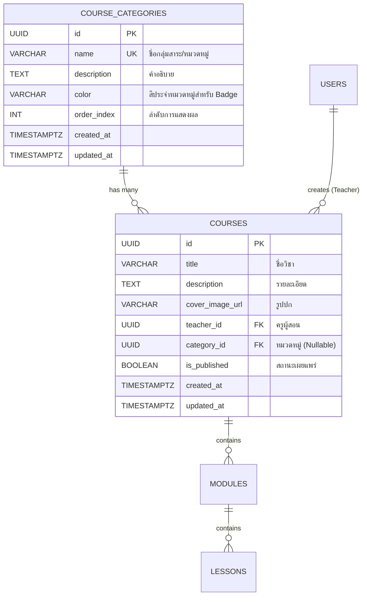
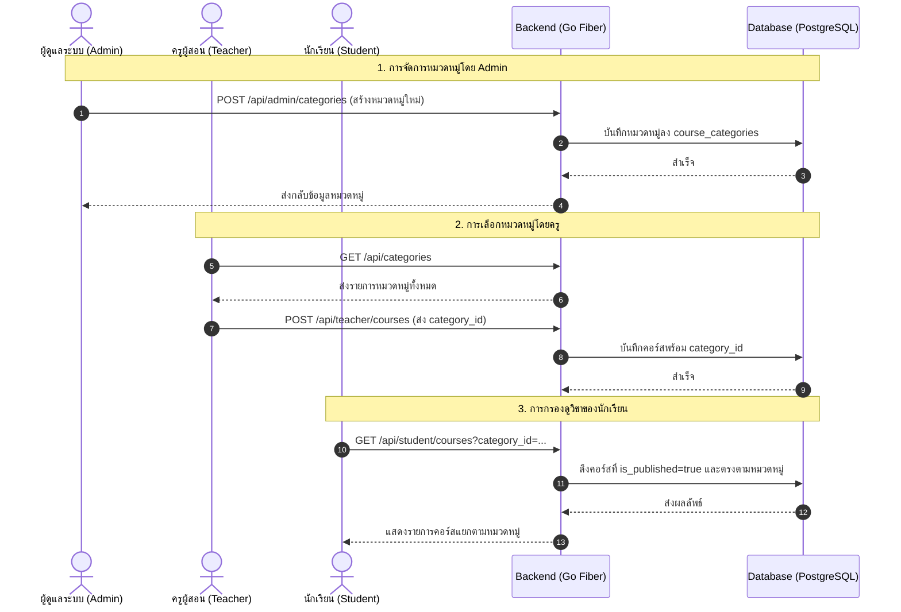

# แผนการพัฒนา: ระบบหมวดหมู่รายวิชา (Course Categories Management)

เอกสารฉบับนี้วิเคราะห์ผลกระทบต่อระบบ นำเสนอโครงสร้างฐานข้อมูล สถาปัตยกรรม API และระบุรายการงานย่อย (Implementation Checklist) สำหรับการพัฒนาระบบจัดการหมวดหมู่รายวิชาในแพลตฟอร์ม **TUNorth-Hub**

---

## 1. บทนำและวัตถุประสงค์ (Overview & Objectives)

ระบบหมวดหมู่รายวิชา (Course Categories) ออกแบบมาเพื่อเพิ่มประสิทธิภาพในการจัดกลุ่มและค้นหารายวิชาในแพลตฟอร์มการเรียนรู้ โดยมีเป้าหมายหลักคือ:
1. **การควบคุมแบบรวมศูนย์โดย Admin (Centralized Administration):** กำหนดให้เฉพาะ **Admin** เท่านั้นที่เป็นผู้สร้าง แก้ไข ลบ และจัดเรียงหมวดหมู่รายวิชา เพื่อรักษามาตรฐาน taxonomy และกลุ่มสาระการเรียนรู้ของโรงเรียน
2. **การกำหนดหมวดหมู่ของครูผู้สอน (Teacher Assignment):** ครูผู้สอนสามารถเลือกหมวดหมู่ที่เหมาะสมให้แก่คอร์สของตนเองผ่าน Dropdown เมนู โดยไม่ต้องพิมพ์สร้างหมวดหมู่ใหม่เอง
3. **การค้นหาและกรองเนื้อหาของนักเรียน (Student Filtering & Discovery):** นักเรียนสามารถค้นหาและกรองดูรายวิชาที่สนใจตามกลุ่มสาระการเรียนรู้ได้อย่างรวดเร็วและเป็นสัดส่วน

---

## 2. การวิเคราะห์ผลกระทบต่อระบบ (System Impact Analysis)

### 2.1 ด้านฐานข้อมูลและความเข้ากันได้ (Database & Backward Compatibility)
| ตาราง / ฟิลด์ | การเปลี่ยนแปลงและผลกระทบ | การรองรับความเข้ากันได้ (Backward Compatibility) |
| :--- | :--- | :--- |
| **ตารางใหม่ `course_categories`** | เก็บข้อมูลหมวดหมู่วิชา (`id`, `name`, `description`, `color`, `order_index`, timestamps) | ไม่มีผลกระทบต่อตารางเดิม รองรับ GORM `AutoMigrate` ได้ทันที |
| **ตาราง `courses`** | เพิ่มคอลัมน์ `category_id` (UUID, Foreign Key, Nullable) | คอร์สเดิมในระบบจะมีค่า `category_id = NULL` โดยระบบจะแสดงผลเป็น "ไม่ระบุหมวดหมู่ / ทั่วไป" โดยไม่มี Data Loss |
| **ความสัมพันธ์การลบ (`ON DELETE`)** | กำหนดเงื่อนไข Foreign Key เป็น `ON DELETE SET NULL` | เมื่อ Admin ลบหมวดหมู่ใดๆ คอร์สวิชาในหมวดหมู่นั้นจะถูกปรับเป็น Uncategorized โดยที่ตัวคอร์สและบทเรียนจะไม่ถูกลบ |

### 2.2 ด้านการควบคุมสิทธิ์และการเข้าถึง (RBAC & Security Isolation)
* 👨‍💼 **ADMIN (ผู้ดูแลระบบ):**
  * เข้าถึง API จัดการหมวดหมู่แบบเต็มรูปแบบ (`POST/PUT/DELETE /api/admin/categories`)
  * ป้องกันการสร้างชื่อหมวดหมู่ซ้ำ (Unique Constraint บนชื่อหมวดหมู่)
* 👩‍🏫 **TEACHER (ครูผู้สอน):**
  * มีสิทธิ์เพียงเรียกดูรายการหมวดหมู่ (`GET /api/categories`) และเลือกกำหนด `category_id` ให้แก่คอร์สที่ตนเป็นเจ้าของ
  * ไม่มีสิทธิ์สร้างหรือแก้ไขชื่อหมวดหมู่ เพื่อป้องกันปัญหาชื่อหมวดหมู่กระจัดกระจาย
* 🧑‍🎓 **STUDENT (นักเรียน) & Public:**
  * สามารถอ่านรายการหมวดหมู่และกรองรายการวิชาใน Catalog ตาม `category_id` ได้

---

## 3. สถาปัตยกรรมและการเชื่อมโยงข้อมูล (Architecture & Data Flow)

### 3.1 Entity Relationship Diagram (ERD)



### 3.2 ลำดับขั้นตอนการทำงาน (Sequence Workflow)



---

## 4. รายการงานย่อยและ Checklist การพัฒนา (Implementation Checklist)

### 📌 4.1 Database & Backend Models (Go + GORM)
- [x] **การสร้างและอัปเดตโมเดลข้อมูล (`models.go`)**
  - [x] เพิ่ม struct `CourseCategory` ใน `backend/internal/models/models.go`
  - [x] เพิ่มฟิลด์ `CategoryID *uuid.UUID` และ `Category *CourseCategory` ใน struct `Course`
  - [x] กำหนด GORM Tags: `uniqueIndex` สำหรับชื่อหมวดหมู่ และ `foreignKey:CategoryID;constraint:OnDelete:SET NULL`
- [x] **การ Migration และ Seed ข้อมูลเริ่มต้น (`database.go` & `seed.go`)**
  - [x] เพิ่ม `&models.CourseCategory{}` เข้าใน `AutoMigrate()` ภายใน `backend/internal/database/database.go`
  - [x] เพิ่มฟังก์ชัน `SeedDefaultCategories` สำหรับสร้างหมวดหมู่กลุ่มสาระเริ่มต้น (เช่น วิทยาศาสตร์และเทคโนโลยี, คณิตศาสตร์, ภาษาต่างประเทศ, ภาษาไทย, สังคมศึกษา, ศิลปะและดนตรี, สุขศึกษาและพลศึกษา, การงานอาชีพ, ทั่วไป/กิจกรรม)

---

### 📌 4.2 Backend Handlers & API Routes (Go Fiber)
- [x] **สร้าง Category Handler ใหม่ (`categories.go`)**
  - [x] สร้างไฟล์ `backend/internal/handlers/categories.go`
  - [x] พัฒนาฟังก์ชัน `ListCategories` (รองรับการเรียกดูทั่วไป เรียงตาม `order_index ASC`)
  - [x] พัฒนาฟังก์ชัน `CreateCategory` (ตรวจสอบสิทธิ์ Admin, Validate ความยาวชื่อ, ตรวจสอบชื่อซ้ำ)
  - [x] พัฒนาฟังก์ชัน `UpdateCategory` (แก้ไขชื่อ, คำอธิบาย, สี Badge, ลำดับ)
  - [x] พัฒนาฟังก์ชัน `DeleteCategory` (ลบหมวดหมู่ และปลดคอร์สที่เกี่ยวข้องเป็น NULL อัตโนมัติ)
  - [x] พัฒนาฟังก์ชัน `ReorderCategories` (บันทึกลำดับ `order_index` แบบ Batch)
- [x] **ปรับปรุง Course Handlers เดิม (`courses.go` & `student_courses.go`)**
  - [x] อัปเดต `ListTeacherCourses` และ `GetTeacherCourse` ให้ Preload ความสัมพันธ์ `"Category"`
  - [x] อัปเดต `CreateCourse` และ `UpdateCourse` ใน `courses.go` ให้รองรับการรับและบันทึก `category_id`
  - [x] อัปเดต `ListPublishedCourses` ใน `student_courses.go` ให้รองรับ Query Parameter กรองตาม `category_id` และ Preload `"Category"`
- [x] **การลงทะเบียน Route ใน Fiber Router (`routes.go`)**
  - [x] ลงทะเบียน Route สาธารณะ/ผู้ใช้ทั่วไป: `GET /api/categories`
  - [x] ลงทะเบียน Route เฉพาะ Admin:
    - `POST /api/admin/categories`
    - `PUT /api/admin/categories/:id`
    - `DELETE /api/admin/categories/:id`
    - `POST /api/admin/categories/reorder`

---

### 📌 4.3 Frontend Admin Management UI
- [x] **สร้าง UI สำหรับจัดการหมวดหมู่ใน Admin Dashboard**
  - [x] เพิ่มเมนู/แท็บสำหรับ "จัดการหมวดหมู่รายวิชา" ในหน้า Admin (`frontend/src/app/admin/categories/page.tsx` พร้อมลิงก์ใน Navbar)
  - [x] ตารางแสดงรายชื่อหมวดหมู่ (ชื่อ, รหัสสี, จำนวนวิชาในหมวดหมู่นั้น, วันที่สร้าง)
  - [x] Modal เพิ่มหมวดหมู่ใหม่ (ระบุชื่อ, คำอธิบาย, ตัวเลือกสี Hex / Color Palette Preset)
  - [x] Modal แก้ไขหมวดหมู่เดิม
  - [x] Modal ยืนยันการลบหมวดหมู่ (แจ้งเตือนจำนวนวิชาที่จะถูกปลดเป็นไม่มีหมวดหมู่)
  - [x] ปุ่มสำหรับจัดเรียงลำดับหมวดหมู่ (Drag & Drop หรือปุ่มเลื่อนขึ้น/ลง)
  - [x] เชื่อมต่อการแจ้งเตือนด้วย `toast` (Sonner Toast) เมื่อทำรายการสำเร็จหรือเกิดข้อผิดพลาด

---

### 📌 4.4 Frontend Teacher Course Builder Integration
- [x] **สร้างและแก้ไขคอร์สโดยครูผู้สอน (`/teacher` & `/teacher/courses/[id]`)**
  - [x] ใน Modal "สร้างรายวิชาใหม่" (`frontend/src/app/teacher/page.tsx`): เพิ่ม Dropdown เลือกหมวดหมู่รายวิชา
  - [x] ในหน้าตั้งค่าคอร์ส (`frontend/src/app/teacher/courses/[id]/page.tsx`): เพิ่มช่องเลือก/เปลี่ยนหมวดหมู่รายวิชา
  - [x] แสดง Badge ชื่อหมวดหมู่พร้อมสีประจำหมวดหมู่บนการ์ดรายวิชาของครู

---

### 📌 4.5 Frontend Student Course Catalog & Discovery
- [x] **การค้นหาและกรองรายวิชาของนักเรียน (`/student`)**
  - [x] ดึงรายการหมวดหมู่ทั้งหมดมาแสดงเป็น Filter Tabs (แถบปุ่มกดเลือกหมวดหมู่ เช่น "ทั้งหมด", "วิทยาศาสตร์", "คณิตศาสตร์", ...)
  - [x] รองรับการทำงานร่วมกันระหว่าง ช่องค้นหาชื่อวิชา (Search Bar) และตัวกรองหมวดหมู่ (Category Filter)
  - [x] แสดง Tag/Badge หมวดหมู่บนการ์ดรายวิชาในหน้า Catalog และหน้าคอร์สของฉัน
  - [x] แสดงสถานะ Empty State สวยงามเมื่อไม่พบรายวิชาในหมวดหมู่ที่เลือก

---

### 📌 4.6 อัปเดตเอกสารระบบ (Documentation & Specifications)
- [x] **อัปเดต `docs/spec.md`**
  - [x] เพิ่มหัวข้อ Data Model ตารางที่ 11 `CourseCategories`
  - [x] อัปเดตตารางที่ 2 `Courses` เพิ่มคอลัมน์ `category_id`
  - [x] อัปเดต API Routes Matrix เพิ่มกลุ่ม Category Endpoints
  - [x] บันทึกรายการใน Checklist ของ Phase 3 / Phase 5

---

## 5. แผนการทดสอบและตรวจสอบความถูกต้อง (Verification Plan)

### 5.1 Automated & API Verification
```powershell
# 1. ทดสอบ AutoMigrate และ Seed Data
cd backend
go run cmd/seed/main.go

# 2. ทดสอบ Backend Unit & Integration Logic
go test ./...
```

### 5.2 Manual Verification Steps
1. **Admin Category Operations:**
   - ล็อกอินด้วยบัญชี Admin (`admin@tunorth.ac.th`)
   - ทดสอบสร้างหมวดหมู่ใหม่ เช่น "ภาษาญี่ปุ่นเบื้องต้น" พร้อมเลือกสี
   - ทดสอบแก้ไขชื่อและเปลี่ยนสี
   - ทดสอบจัดเรียงลำดับหมวดหมู่
2. **Teacher Course Assignment:**
   - ล็อกอินด้วยบัญชี Teacher (`teacher@tunorth.ac.th`)
   - สร้างคอร์สใหม่โดยเลือกหมวดหมู่ที่ Admin สร้างขึ้น
   - ตรวจสอบว่าคอร์สแสดงผล Badge หมวดหมู่ถูกต้อง
3. **Student Filtering:**
   - ล็อกอินด้วยบัญชี Student (`student1@tunorth.ac.th`)
   - คลิกเลือกแท็บหมวดหมู่ต่างๆ ตรวจสอบว่าคอร์สแสดงผลและกรองตรงตามหมวดหมู่จริง
4. **Category Deletion Safety Check:**
   - ให้ Admin ลบหมวดหมู่ที่มีคอร์สผูกอยู่
   - ตรวจสอบว่าคอร์สนั้นยังคงอยู่ในระบบตามปกติ แต่เปลี่ยนสถานะหมวดหมู่เป็น "ไม่ระบุหมวดหมู่"
