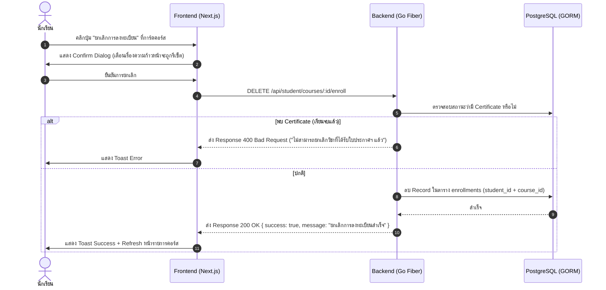

# แผนการพัฒนา: ระบบยกเลิกการลงทะเบียนเรียนรายวิชา (Course Unenrollment / Drop Course)

เอกสารฉบับนี้วิเคราะห์ผลกระทบต่อระบบ นำเสนอแนวทางการออกแบบ และระบุรายการงานย่อย (Checklist) สำหรับการพัฒนาระบบยกเลิกการลงทะเบียนเรียนในแพลตฟอร์ม TUNorth-Hub

---

## 1. บทนำและวัตถุประสงค์ (Overview & Objectives)

ระบบยกเลิกการลงทะเบียนเรียนรายวิชา (Course Unenrollment / Drop Course) มีเป้าหมายเพื่อ:
1. อนุญาตให้นักเรียนสามารถถอนหรือยกเลิกรายวิชาที่ตนเองไม่ได้ต้องการเรียน หรือลงทะเบียนผิดพลาดได้ด้วยตนเอง
2. ปรับปรุงสถานะของผู้เรียนและตัวนับจำนวนนักเรียนในแดชบอร์ดของครูและแอดมินให้ถูกต้องตรงกับความเป็นจริง
3. จัดการความก้าวหน้า (Progress), สิทธิ์การเข้าถึงเนื้อหา (Access Control) และความสอดคล้องของใบประกาศนียบัตร (Certificates) อย่างรัดกุม

---

## 2. การวิเคราะห์ผลกระทบต่อระบบ (System Impact Analysis)

### 2.1 ด้านฐานข้อมูลและความก้าวหน้า (Database & Progress)
| ตาราง / ข้อมูล | พฤติกรรมและผลกระทบ | ข้อสรุป / แนวทางจัดการ |
| :--- | :--- | :--- |
| **ตาราง `enrollments`** | ลบแถวข้อมูลการลงทะเบียนของนักเรียนในรายวิชานั้น | Hard Delete ทันที (หรือ Soft Delete ตามนโยบาย) |
| **ความก้าวหน้า (`completed_lessons`, `progress_percent`)** | ข้อมูลบทเรียนที่ผ่านแล้วและเปอร์เซ็นต์ความก้าวหน้าจะถูกรีเซ็ต | เมื่อยกเลิกแล้วกลับมาลงใหม่จะเริ่มต้นที่ 0% |
| **จำนวนผู้เรียน (`enrolled_students`)** | สถิติตัวนับผู้เรียนในคอร์สของครูผู้สอนจะลดลงอัตโนมัติ 1 คน | คำนวณตามจำนวน record จริงใน `enrollments` |
| **การเข้าถึงเนื้อหาห้องเรียน** | สิทธิ์การเปิดดูวิดีโอ, เอกสาร, Code Lab ใน Course Player | ถูกระงับทันทีจนกว่าจะกดลงทะเบียนใหม่ |

### 2.2 ด้านการส่งการบ้านและแบบทดสอบ (Submissions & Quiz Attempts)
* **การส่งการบ้าน (`submissions`)**: ผูกกับ `assignment_id` และ `student_id`
  * *แนวทาง:* คงข้อมูลการส่งงานและคะแนนเดิมไว้ในฐานข้อมูลเพื่อเป็นประวัติทางวิชาการ (Audit trail)
* **ผลการทำแบบทดสอบ (`quiz_attempts`)**: ผูกกับ `quiz_id` และ `student_id`
  * *แนวทาง:* คงประวัติการทำแบบทดสอบไว้ หรือหากต้องการรีเซ็ตให้สามารถกำหนดผ่านการยืนยันได้

### 2.3 ด้านใบประกาศนียบัตร (Certificates)
> [!WARNING]
> **กรณีที่ผู้เรียนสำเร็จการศึกษา 100% และได้รับใบประกาศนียบัตรแล้ว:**
> - หากยกเลิกการลงทะเบียน อาจส่งผลให้ใบประกาศนียบัตรที่มีรหัสตรวจสอบ (Verification Code) ขัดแย้งกับสถานะการเรียนจริง
> - **แนวทางปฏิบัติ:** **ไม่อนุญาตให้นักเรียนและครูผู้สอนกดยกเลิก/ถอนรายวิชาที่ออกใบประกาศนียบัตรไปแล้ว (Completed/Certified)** เพื่อรักษาสถานะทางวิชาการและป้องกัน Human Error โดยปุ่มถอนของนักเรียนและครูจะถูกปิดใช้งาน (Disabled) และแสดงสถานะ "สำเร็จการศึกษาแล้ว" แทน
> - หากมีความจำเป็นต้องเพิกถอนจริง (เช่น การทุจริตหรือทำผิดวินัย) ต้องเป็นสิทธิ์ของ **Admin** เท่านั้น ซึ่งระบบจะทำการเพิกถอน Certificate ควบคู่ไปด้วยทันที

### 2.4 ด้าน Logic การทำงานเดิม (Auto-Enrollment Mitigation)
> [!IMPORTANT]
> ในไฟล์ [`student_courses.go`](file:///D:/Hub/backend/internal/handlers/student_courses.go#L237-L248) มี Logic เดิมที่จะ **Auto-enroll ให้อัตโนมัติเมื่อเข้า URL `/student/courses/:id/player`**
> 
> **จำเป็นต้องแก้ไข:** ถอด Logic Auto-enroll ออกจาก Course Player หากนักเรียนยังไม่ได้ลงทะเบียน (หรือยกเลิกไปแล้ว) จะต้องไม่อนุญาตให้ดึงข้อมูลคอร์ส และส่งคืน `403 Forbidden` แจ้งให้ลงทะเบียนก่อน

---

## 3. สถาปัตยกรรมและการทำงาน (Architecture & Flow)

---

## 4. รายการงานย่อยและ Checklist การพัฒนา (Implementation Checklist)

### 4.1 Backend (Go Fiber)
- [x] **การสร้าง Endpoint สำหรับยกเลิกการลงทะเบียน**
  - [x] เพิ่มฟังก์ชัน `UnenrollCourse(c *fiber.Ctx) error` ใน [`student_courses.go`](file:///D:/Hub/backend/internal/handlers/student_courses.go)
  - [x] ตรวจสอบความถูกต้องของ `course_id` (UUID format)
  - [x] ตรวจสอบว่าผู้ใช้งานเข้าสู่ระบบและมีบทบาทเป็น `STUDENT`
  - [x] ตรวจสอบว่าผู้ใช้ได้ลงทะเบียนคอร์สนี้อยู่จริงหรือไม่ (หากไม่พบ ให้ส่ง 404 Not Found)
  - [x] ตรวจสอบว่ามีใบประกาศนียบัตร (`Certificate`) ของคอร์สนี้แล้วหรือไม่ หากมีให้ระงับการยกเลิก (ส่ง 400 Bad Request)
  - [x] ดำเนินการลบ Record ออกจากตาราง `enrollments`
  - [x] คืนค่า Response JSON `{ success: true, message: "ยกเลิกการลงทะเบียนรายวิชาเรียบร้อยแล้ว" }`
- [x] **การลงทะเบียน Route ใน Fiber Router**
  - [x] เพิ่ม Route `DELETE /student/courses/:id/enroll` ใน [`routes.go`](file:///D:/Hub/backend/internal/routes/routes.go) ภายใต้ `studentGroup`
- [x] **การปรับปรุง Course Player Authorization**
  - [x] แก้ไขฟังก์ชัน `GetCoursePlayer` ใน [`student_courses.go`](file:///D:/Hub/backend/internal/handlers/student_courses.go)
  - [x] นำท่อนโค้ด `Auto-enroll` ออก
  - [x] หากไม่พบ `Enrollment` ให้คืนค่า `403 Forbidden` พร้อมข้อความแจ้งเตือน "คุณยังไม่ได้ลงทะเบียนในรายวิชานี้"
- [x] **(Optional) Teacher/Admin Management Route**
  - [x] เพิ่มความสามารถให้ครู/แอดมินดูรายชื่อนักเรียนในวิชา `GET /teacher/courses/:id/students` และ `GET /admin/courses/:id/students`
  - [x] เพิ่มความสามารถให้ครู/แอดมินสามารถถอนรายชื่อนักเรียนออกจากคอร์สได้ `DELETE /teacher/courses/:id/students/:studentId` และ `DELETE /admin/courses/:id/students/:studentId`

---

### 4.2 Frontend (Next.js & React)
- [x] **UI ส่วนนักเรียน (Student Dashboard - `/student`)**
  - [x] เพิ่มปุ่มหรือไอคอนเมนูตัวเลือก `...` บนการ์ดคอร์สในแท็บ "คอร์สที่ฉันลงทะเบียนไว้" ([`frontend/src/app/student/page.tsx`](file:///D:/Hub/frontend/src/app/student/page.tsx))
  - [x] เพิ่มตัวเลือก "ยกเลิกการลงทะเบียน (Drop Course)" พร้อมสีแดงเพื่อเตือนการกระทำที่สำคัญ
  - [x] สร้าง Confirmation Dialog / Modal:
    - [x] แสดงชื่อวิชาที่ต้องการยกเลิก
    - [x] ข้อความเตือน: *"ความก้าวหน้าในการเรียนทั้งหมดจะถูกรีเซ็ต คุณแน่ใจหรือไม่ที่จะยกเลิกการลงทะเบียน?"*
    - [x] ปุ่ม "ยกเลิก" (Cancel) และปุ่ม "ยืนยันการยกเลิก" (Confirm Drop)
  - [x] จัดการ State การเรียก API (`isUnenrolling`, Loading Spinner)
  - [x] เชื่อมต่อ API `DELETE /api/student/courses/${courseId}/enroll` ผ่านฟังก์ชัน `apiFetch`
  - [x] แสดง Toast แจ้งเตือนผลลัพธ์ผ่าน `toast.success` หรือ `toast.error`
  - [x] Re-fetch ข้อมูลรายวิชาและคอร์สของฉันเพื่ออัปเดต UI ทันที
- [x] **UI ส่วนหน้าบทเรียน (Course Player - `/student/courses/[id]`)**
  - [x] ตรวจสอบ Error Response เมื่อโหลดหน้า Course Player ([`frontend/src/app/student/courses/[id]/page.tsx`](file:///D:/Hub/frontend/src/app/student/courses/[id]/page.tsx))
  - [x] กรณีพบสถานะ `403 Forbidden` หรือไม่พบการลงทะเบียน ให้แสดงข้อความแจ้งเตือนและมีปุ่มกดกลับไปหน้าหลักรายวิชาเพื่อลงทะเบียน

---

### 4.3 การตรวจสอบความปลอดภัยและกฎทางธุรกิจ (Policy & Validation)
- [x] ไม่อนุญาตให้นักเรียนยกเลิกการลงทะเบียนของผู้อื่น (ตรวจสอบผ่าน `claims.UserID` จาก Token เท่านั้น)
- [x] ป้องกันการยกเลิกวิชาที่สำเร็จการศึกษาแล้ว (ได้รับ Certificate แล้ว)
- [x] ตรวจสอบการนับจำนวนผู้เรียนในฝั่งครูผู้สอนให้ลดลงตรงตามจริงทันที

---

## 5. แผนการทดสอบและการตรวจสอบ (Verification & Test Plan)

### 5.1 การทดสอบ Backend API (API Verification)
- [x] **Test Case 1: Unenroll ปกติ**
  - นักเรียนที่ลงทะเบียนคอร์ส A กดยกเลิก -> คืนค่า `200 OK`, Record ใน DB หายไป
- [x] **Test Case 2: Unenroll ซ้ำ หรือยังไม่ได้ลงทะเบียน**
  - กดยกเลิกคอร์สที่ไม่ได้ลงทะเบียน -> คืนค่า `404 Not Found` หรือ Error Message ที่ชัดเจน
- [x] **Test Case 3: Unenroll คอร์สที่เรียนจบ 100% และมี Certificate แล้ว**
  - นักเรียนที่มี Certificate กดยกเลิก -> คืนค่า `400 Bad Request` แจ้งเตือนว่าไม่สามารถยกเลิกได้
- [x] **Test Case 4: ป้องกัน Auto-Enroll ใน Player**
  - นักเรียนที่กดยกเลิกไปแล้ว พยายามเข้า URL `/student/courses/:id/player` -> คืนค่า `403 Forbidden` และไม่เกิด Record ใหม่ใน `enrollments`

### 5.2 การทดสอบผ่านหน้าจอผู้ใช้งาน (UI/UX Verification)
- [x] **Test Case 5: Flow การยกเลิกบน Dashboard นักเรียน**
  - เข้าหน้า `/student` -> คลิกยกเลิก -> กดยืนยันใน Modal -> การ์ดคอร์สหายไปจาก "คอร์สของฉัน" และปุ่มในแค็ตตาล็อกกลับเป็น "ลงทะเบียนเรียน"
- [x] **Test Case 6: การแสดงผล Toast Notification**
  - แสดง Toast สีเขียวเมื่อสำเร็จ หรือสีแดงเมื่อเกิดข้อผิดพลาด
- [x] **Test Case 7: ตรวจสอบมุมมองของครูผู้สอน**
  - เข้าสู่ระบบด้วยบัญชี Teacher -> ตรวจสอบว่าจำนวนนักเรียนในคอร์สดังกล่าวลดลง 1 คน
