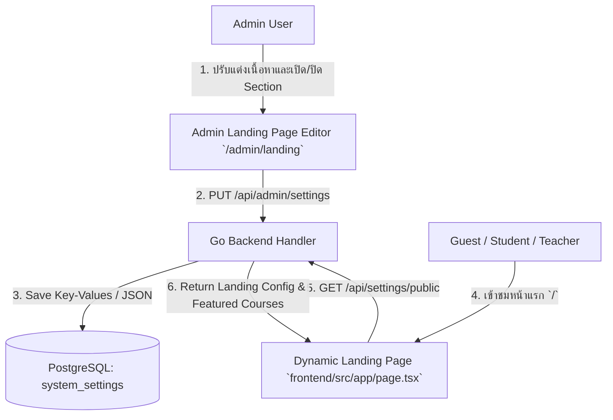

# 🎨 Implementation Plan: ระบบจัดการ Landing Page (Landing Page Management CMS)

## 📌 1. วัตถุประสงค์และภาพรวม (Goal & Overview)
พัฒนาระบบจัดการหน้า Landing Page แบบไดนามิก (Landing Page CMS) สำหรับแพลตฟอร์ม **TUNorth-Hub** เพื่อให้ผู้ดูแลระบบ (Admin) สามารถปรับแต่งเนื้อหา ข้อความ รูปภาพ โครงสร้างส่วนประกอบ (Sections) สถิติ คอร์สแนะนำ จุดเด่น และคำถามที่พบบ่อย (FAQ) บนหน้าแรก (`/`) ได้อย่างอิสระผ่านระบบ Admin โดยไม่ต้องแก้ไขโค้ด พร้อมระบบ Default Fallback และรองรับ Dark / Light Mode อย่างสมบูรณ์แบบ

### ✅ รายการงานหลัก (Overview Checklist)
- [x] ออกแบบโครงสร้างข้อมูลและการจัดเก็บ Config บนตาราง `system_settings`
- [x] เพิ่มค่าคอนฟิกเริ่มต้น (Seed Defaults) ในฝั่ง Go Backend
- [x] พัฒนา Public API สำหรับดึงข้อมูลคอนฟิกหน้าแรกและคอร์สแนะนำ
- [x] พัฒนาหน้าจัดการสำหรับผู้ดูแลระบบ (`/admin/landing`) แบบ Card Grid Tabs 7 หมวดหมู่
- [x] ปรับปรุงหน้าแรก (`/`) ให้ดึงข้อมูลและแสดงผลแบบ Dynamic 100%
- [x] ปรับปรุง Navbar และ Layout ให้รองรับทุกขนาดหน้าจอ (Responsive สำหรับ Mobile, iPad Air, Desktop)
- [x] อัปเดตเอกสารระบบ (`docs/spec.md`, `gemini.md`)

---

## 🏛️ 2. สถาปัตยกรรมและการไหลของข้อมูล (Architecture & Data Flow)

### ✅ สถาปัตยกรรม Checklist
- [x] **Zero Schema Migration:** ใช้ตาราง `system_settings` ที่มีอยู่เดิม พร้อมจัดหมวดหมู่ `LANDING`
- [x] **Public Safe Endpoint:** `GET /api/settings/public` กรองเฉพาะคีย์ที่ปลอดภัยสำหรับผู้ใช้ทั่วไป
- [x] **Decoupled JSON Storage:** จัดเก็บข้อมูลแบบรายการ (Stats, Features, Steps, FAQ) ในรูปแบบ JSON String

---

## ⚙️ 3. โครงสร้างคีย์การตั้งค่า (Landing Page Config Keys)

| Key Name | Category | Type | Description |
| :--- | :--- | :--- | :--- |
| `landing_hero_badge` | LANDING | String | ข้อความ Badge ด้านบนหัวข้อ Hero |
| `landing_hero_title` | LANDING | String | หัวข้อหลัก Hero บรรทัดที่ 1 |
| `landing_hero_highlight` | LANDING | String | ข้อความไฮไลต์สี Gradient บรรทัดที่ 2 |
| `landing_hero_subtitle` | LANDING | String | คำบรรยายใต้หัวข้อ Hero |
| `landing_hero_cta_primary_text` | LANDING | String | ข้อความปุ่มดำเนินการหลัก (Primary CTA) |
| `landing_hero_cta_primary_link` | LANDING | String | ลิงก์ปุ่มดำเนินการหลัก |
| `landing_hero_cta_secondary_text` | LANDING | String | ข้อความปุ่มดำเนินการรอง (Secondary CTA) |
| `landing_hero_cta_secondary_link` | LANDING | String | ลิงก์ปุ่มดำเนินการรอง |
| `landing_hero_image_url` | LANDING | String | URL รูปภาพ Hero Showcase / Banner |
| `landing_stats_enabled` | LANDING | Boolean | สวิตช์เปิด/ปิด แถบสรุปสถิติระบบ |
| `landing_stats_json` | LANDING | JSON | ข้อมูลสถิติ `[{label, value, suffix, icon}]` |
| `landing_features_enabled` | LANDING | Boolean | สวิตช์เปิด/ปิด ส่วนจุดเด่นระบบ |
| `landing_features_title` | LANDING | String | หัวข้อส่วนจุดเด่นระบบ |
| `landing_features_subtitle` | LANDING | String | คำอธิบายส่วนจุดเด่นระบบ |
| `landing_features_json` | LANDING | JSON | รายการการ์ดฟีเจอร์ `[{id, title, description, icon, color}]` |
| `landing_courses_enabled` | LANDING | Boolean | สวิตช์เปิด/ปิด ส่วนคอร์สแนะนำ |
| `landing_courses_title` | LANDING | String | หัวข้อส่วนคอร์สแนะนำ |
| `landing_courses_subtitle` | LANDING | String | คำอธิบายส่วนคอร์สแนะนำ |
| `landing_steps_enabled` | LANDING | Boolean | สวิตช์เปิด/ปิด ส่วนขั้นตอนการใช้งาน |
| `landing_steps_title` | LANDING | String | หัวข้อส่วนขั้นตอนการใช้งาน |
| `landing_steps_subtitle` | LANDING | String | คำอธิบายส่วนขั้นตอนการใช้งาน |
| `landing_steps_json` | LANDING | JSON | รายการขั้นตอน `[{step, title, desc}]` |
| `landing_faq_enabled` | LANDING | Boolean | สวิตช์เปิด/ปิด ส่วนคำถามที่พบบ่อย |
| `landing_faq_title` | LANDING | String | หัวข้อส่วน FAQ |
| `landing_faq_subtitle` | LANDING | String | คำอธิบายส่วน FAQ |
| `landing_faq_json` | LANDING | JSON | รายการคำถาม-คำตอบ `[{question, answer}]` |
| `landing_cta_enabled` | LANDING | Boolean | สวิตช์เปิด/ปิด แถบเชิญชวนท้ายหน้า |
| `landing_cta_title` | LANDING | String | หัวข้อแถบเชิญชวนท้ายหน้า |
| `landing_cta_subtitle` | LANDING | String | คำอธิบายแถบเชิญชวนท้ายหน้า |
| `landing_cta_button_text` | LANDING | String | ข้อความปุ่มแถบเชิญชวนท้ายหน้า |
| `landing_footer_text` | LANDING | String | ข้อความลิขสิทธิ์ประจำโรงเรียน (Footer Copyright) |

---

## 🛠️ 4. แผนงานและรายการงานย่อย (Implementation Sub-tasks)

### 🔹 4.1 Backend Engine & API Routes (`backend`)
- [x] **Database Seeding (`backend/internal/database/database.go`):**
  - [x] เพิ่ม Default Settings ครบทุกคีย์สำหรับ Category `LANDING`
  - [x] กำหนดชื่อโรงเรียนเริ่มต้นเป็น `"โรงเรียนเตรียมอุดมศึกษา ภาคเหนือ"`
  - [x] กำหนดชื่อระบบเริ่มต้นเป็น `"TUNorth-Hub"`
  - [x] กำหนดข้อความ Footer ลิขสิทธิ์เริ่มต้นให้สอดคล้องกัน
  - [x] เพิ่ม Logic อัปเดตข้อมูลอัตโนมัติหากตรวจพบชื่อโรงเรียนเดิมใน Database
- [x] **Public Settings Handler (`backend/internal/handlers/settings.go`):**
  - [x] แก้ไข `GetPublicSettings` ให้ query ค่าคอนฟิกคีย์ `landing_*` และ `category = 'LANDING'`
  - [x] แก้ไข `UpdateAdminSettings` ให้ระบุ `Category = "LANDING"` อัตโนมัติเมื่อบันทึกคีย์ที่ขึ้นต้นด้วย `landing_`
- [x] **Public Courses Route (`backend/internal/routes/routes.go`):**
  - [x] เพิ่ม Route `GET /api/courses/public` ผูกกับ `studentCourseHandler.ListPublishedCourses` สำหรับแขกผู้เยี่ยมชมหน้าแรก
- [x] **Backend Validation:**
  - [x] ตรวจสอบ Type Safety และ Syntax ด้วย `go vet ./...` ผ่าน 100%

---

### 🔹 4.2 Admin Landing Page Management Portal (`/admin/landing`)
- [x] **โครงสร้างหน้าและการนำทาง (`frontend/src/app/admin/landing/page.tsx`):**
  - [x] พัฒนา Card Grid Tabs 7 หมวดหมู่ (Hero, Stats, Features, Courses, Steps, FAQ, CTA/Footer)
  - [x] ออกแบบ Header Bar สไตล์โมเดิร์น พร้อม Badge `Landing Page CMS`
  - [x] ปุ่ม Action: ดูหน้าแรก (`/`), คืนค่าเริ่มต้น (Reset to Defaults), บันทึกการเปลี่ยนแปลง (Save)
- [x] **แท็บ 1: Hero & หัวข้อหลัก:**
  - [x] ปรับแต่ง Badge, Title (Line 1), Gradient Highlight (Line 2), Subtitle
  - [x] ปรับแต่งข้อความและลิงก์ของปุ่ม Primary CTA และ Secondary CTA
  - [x] ระบบอัปโหลดภาพ Banner Showcase พร้อมการ์ดแสดงตัวอย่าง (Preview Thumbnail)
  - [x] ปุ่มลบรูปภาพ (Delete / Clear Image) สีแดงพร้อมไอคอนถังขยะ
- [x] **แท็บ 2: แถบสรุปสถิติระบบ (Stats Bar):**
  - [x] สวิตช์เปิด/ปิดแถบสถิติ
  - [x] รายการสถิติแบบไดนามิก: เพิ่มรายการใหม่, แก้ไขข้อความ/ตัวเลข/หน่วยนับ, เลือกไอคอน Lucide, ลบรายการ
- [x] **แท็บ 3: จุดเด่นของระบบ (Core Features Grid):**
  - [x] สวิตช์เปิด/ปิดส่วนฟีเจอร์
  - [x] แก้ไขหัวข้อและคำบรรยายของหมวดฟีเจอร์
  - [x] รายการการ์ดฟีเจอร์: เพิ่มการ์ดใหม่, แก้ไขชื่อ/คำอธิบาย, เลือกไอคอน Lucide, เลือกโทนสี (Hex Color Picker), ลบการ์ด
- [x] **แท็บ 4: คอร์สเรียนแนะนำ (Featured Courses):**
  - [x] สวิตช์เปิด/ปิดส่วนคอร์สแนะนำ
  - [x] แก้ไขหัวข้อและคำอธิบาย
- [x] **แท็บ 5: ขั้นตอนการเริ่มต้นใช้งาน (How It Works Steps):**
  - [x] สวิตช์เปิด/ปิดส่วนขั้นตอน
  - [x] แก้ไขหัวข้อและคำอธิบาย
  - [x] รายการขั้นตอน 4 สเต็ป: เพิ่ม/แก้ไข/ลบ ขั้นตอนและคำอธิบาย
- [x] **แท็บ 6: คำถามที่พบบ่อย (FAQ Accordion):**
  - [x] สวิตช์เปิด/ปิดส่วน FAQ
  - [x] แก้ไขหัวข้อและคำอธิบาย
  - [x] รายการคำถาม-คำตอบ: เพิ่มคำถามใหม่, แก้ไขคำถาม-คำตอบ, ลบคำถาม
- [x] **แท็บ 7: CTA Banner & ส่วนท้ายเว็บ (Footer):**
  - [x] สวิตช์เปิด/ปิดแถบเชิญชวนท้ายหน้า
  - [x] แก้ไขหัวข้อ, คำอธิบาย และข้อความปุ่ม CTA
  - [x] แก้ไขข้อความลิขสิทธิ์ Footer Copyright ประจำโรงเรียน

---

### 🔹 4.3 หน้าแรกสาธารณะแบบไดนามิก (`frontend/src/app/page.tsx`)
- [x] **Data Fetching & State Integration:**
  - [x] ซิงค์คอนฟิกจาก `GET /api/settings/public`
  - [x] ซิงค์รายการคอร์สจาก `GET /api/courses/public`
- [x] **Section Components Rendering:**
  - [x] **Header/Navbar:** แสดงโลโก้, ชื่อระบบ `TUNorth-Hub`, ชื่อโรงเรียน `โรงเรียนเตรียมอุดมศึกษา ภาคเหนือ`, ปุ่มสลับ Dark/Light Mode, ปุ่มเข้าสู่ระบบ/แดชบอร์ด
  - [x] **Hero Section:** แสดง Badge, Title Line 1 และ Line 2 Highlight Gradient อย่างสมส่วนไม่ตกบรรทัด
  - [x] **Hero CTA Buttons:** แสดงปุ่ม Primary CTA และ Secondary CTA ทันทีเมื่อมีการตั้งค่า
  - [x] **Hero Showcase Image:** แสดงรูปภาพ Banner ใต้ส่วน Hero เมื่อมีการอัปโหลด
  - [x] **Stats Bar:** แสดงผล 4 คอลัมน์พร้อมไอคอน Lucide ตามที่คอนฟิก
  - [x] **Features Grid:** แสดงผล Grid 3 คอลัมน์พร้อมสีประจำฟีเจอร์
  - [x] **Featured Courses Showcase:** แสดงผล Course Cards พร้อมปกวิชา, หมวดหมู่, และชื่อครูผู้สอน
  - [x] **Steps Timeline:** แสดงผล 4 ขั้นตอนการใช้งาน
  - [x] **Interactive FAQ Accordion:** รองรับการคลิกคลี่/หุบคำตอบพร้อมแอนิเมชันลื่นไหล
  - [x] **Call to Action Banner & Footer:** แสดงแถบสี Gradient เชิญชวนท้ายหน้าและข้อความ Footer

---

### 🔹 4.4 การปรับแต่ง Responsive & Navigation (`frontend/src/components/navbar.tsx`)
- [x] **Navbar Labels Optimization:**
  - [x] กระชับชื่อเมนู Admin: `จัดการผู้ใช้`, `หมวดหมู่วิชา`, `จัดการหน้าแรก`, `ตั้งค่าระบบ`
- [x] **Responsive Breakpoints Adaptation:**
  - [x] กำหนดให้จอระดับ Desktop เริ่มต้นที่ `lg:` (1024px+)
  - [x] จอระดับ Tablet (เช่น iPad Air 820px) และ Mobile สลับมาใช้ Drawer Menu (Hamburger) อย่างเป็นระเบียบ ไม่ล้นขอบจอ
  - [x] กำหนด `line-clamp-1` และ `max-w-[150px]` สำหรับชื่อผู้ใช้

---

## 🧪 5. รายการทดสอบและผลการตรวจรับ (Testing & Verification Matrix)

- [x] **Build & Compilation Tests:**
  - [x] Backend `go vet ./...` ผ่าน 100% (Exit code 0)
  - [x] Frontend ESLint `semi: never` ไฟล์ Landing & Navbar ทั้งหมด ผ่าน 100% (0 errors, 0 warnings)
- [x] **Functional Tests:**
  - [x] บันทึกและดึงข้อมูลคอนฟิกลง Database สำเร็จ
  - [x] อัปโหลดภาพ Banner และปุ่มลบรูปภาพทำงานถูกต้อง
  - [x] ปุ่ม Secondary CTA แสดงผลตามข้อความที่แอดมินกำหนด
  - [x] หัวข้อ Line 2 Gradient ไม่ตกบรรทัดและตัดคำได้อย่างสวยงาม
  - [x] การกด Accordion คำถาม-คำตอบบนหน้าแรกทำงานได้ลื่นไหล
  - [x] การแสดงผลบน iPad Air, iPhone/Android และคอมพิวเตอร์หน้าจอกว้าง
