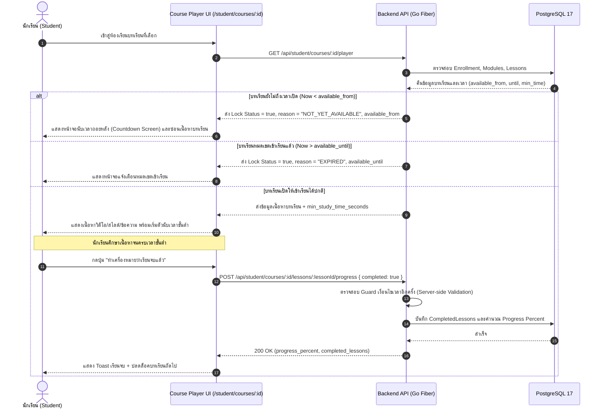

# ⏱️ แผนการพัฒนา: ระบบกำหนดเวลาในบทเรียน (Lesson Time & Schedule Management System)

เอกสารฉบับนี้กำหนดรายละเอียดทางเทคนิค การวิเคราะห์ผลกระทบต่อระบบ (System Impact Analysis), โครงสร้างฐานข้อมูล (Data Model), สัญญารายการ API (API Specifications), สถาปัตยกรรมความปลอดภัยและการควบคุมสิทธิ์ (RBAC & Pacing Security) ตลอดจนรายการงานย่อยและเช็กลิสต์การพัฒนา (Implementation Checklists) สำหรับการพัฒนาระบบกำหนดเวลาในบทเรียนในแพลตฟอร์ม **TUNorth-Hub**

---

## 1. บทนำและวัตถุประสงค์ (Overview & Objectives)

**ระบบกำหนดเวลาในบทเรียน (Lesson Time & Schedule Management System)** ออกแบบมาเพื่อเพิ่มประสิทธิภาพในการควบคุมการเรียนการสอน (Instructional Pacing & Access Governance) ในโรงเรียนมัธยมศึกษา โดยมีเสาหลักการทำงาน 3 มิติหลัก:

1. **Estimated Study Duration (ระยะเวลาเรียนโดยประมาณ):**
   - แสดงเวลาที่แนะนำในการศึกษาของแต่ละบทเรียน (เช่น 15 นาที, 45 นาที) ในหน้าสารบัญ
   - นำไปคำนวณและแสดงเวลารวมทั้งหมดของรายวิชา (Total Course Duration) ทั้งบนหน้ารายละเอียดคอร์สและหน้าแคตตาล็อก
2. **Drip Content & Timed Availability (กำหนดวัน-เวลาเปิดและปิดบทเรียน):**
   - ครูผู้สอนสามารถตั้งเวลาปลดล็อคบทเรียน (`available_from`) ให้นักเรียนเข้าเรียนตามตารางสอนรายสัปดาห์
   - สามารถกำหนดวันหมดเขตเข้าเรียน (`available_until`) สำหรับบทเรียนที่มีกรอบเวลาจำกัด
   - ระบบแสดงสถานะล็อค (Locked State) พร้อมตัวนับเวลาถอยหลัง (Countdown) สำหรับบทเรียนที่ยังไม่ถึงเวลาเปิด
3. **Minimum Study Time Guard (ระบบนับเวลาศึกษาขั้นต่ำก่อนจบ - Anti-Skipping):**
   - ป้องกันนักเรียนกดข้ามบทเรียนทันทีเพื่อปั่นความก้าวหน้า (% Progress) หรือขอรับใบประกาศนียบัตรโดยไม่ศึกษาเนื้อหา
   - ตัวนับเวลาจะล็อคปุ่ม *"ทำเครื่องหมายว่าเรียนจบแล้ว"* จนกว่านักเรียนจะศึกษาเนื้อหาครบตามเวลาขั้นต่ำที่ครูกำหนด

---

## 2. การวิเคราะห์ผลกระทบต่อระบบ (System Impact Analysis)

| มิติ / ส่วนประกอบ (Component) | ระดับผลกระทบ | รายละเอียดผลกระทบและแนวทางรับมือ |
| :--- | :---: | :--- |
| **1. ฐานข้อมูล (Database Schema)** | **ต่ำ (Non-Breaking Migration)** | เพิ่ม 4 คอลัมน์ใหม่ในตาราง `lessons`: `duration_minutes`, `available_from`, `available_until`, `min_study_time_seconds` ทั้งหมดมีค่า Default หรือเป็น Nullable จึงไม่กระทบต่อข้อมูลเดิมในระบบ |
| **2. Backend API & Validation** | **ปานกลาง (Enhanced Handlers)** | อัปเดต `CreateLesson` และ `UpdateLesson` ให้รับค่าเวลาพร้อมตรวจสอบ Validation; อัปเดต `GetStudentCoursePlayer` ให้ส่ง Lock Status และอัปเดต `UpdateLessonProgress` ให้ตรวจสอบเงื่อนไขเวลาก่อนบันทึกสำเร็จ |
| **3. ความปลอดภัยและสิทธิ์ (RBAC Bypass)** | **ควบคุมได้รัดกุม** | ครูผู้สอนเจ้าของคอร์ส และ Admin สามารถเปิดดู/พรีวิวเนื้อหาบทเรียนได้ตลอดเวลา (`Preview Mode`) โดยไม่ถูกบล็อกด้วยเงื่อนไขเวลา แต่นักเรียนจะถูกจำกัดสิทธิ์ตามเวลาจริงอย่างเคร่งครัด |
| **4. ประสบการณ์ผู้ใช้ฝั่งครู (Teacher UX)** | **เชิงบวกสูง (High Positive)** | มีฟอร์มตั้งเวลาใน Lesson Modal ที่ใช้งานง่าย พร้อม Badge สรุปเวลาเรียนบนโครงสร้างคอร์ส |
| **5. ประสบการณ์ผู้ใช้ฝั่งนักเรียน (Student UX)** | **เชิงบวกสูง (High Positive)** | นักเรียนทราบระยะเวลาที่ต้องใช้ในแต่ละบทเรียน มีหน้าจอนับถอยหลังที่ชัดเจน และมีแถบจับเวลานับถอยหลังช่วยส่งเสริมวินัยการเรียนรู้ |

---

## 3. สถาปัตยกรรมและกระบวนการทำงาน (Architecture & Workflow)

### 3.1 ลำดับขั้นตอนการเข้าเรียนและการตรวจเงื่อนไขเวลา (Student Access & Progress Flow)



---

## 4. โครงสร้างข้อมูลและฐานข้อมูล (Data Model Specification)

### 4.1 ตาราง `lessons` (อัปเดตโครงสร้าง)

| ชื่อคอลัมน์ (Column) | ชนิดข้อมูล (Data Type) | ข้อกำหนด (Constraints) | ค่าเริ่มต้น (Default) | คำอธิบาย |
| :--- | :--- | :--- | :--- | :--- |
| `duration_minutes` | `INT` | `NOT NULL` | `0` | ระยะเวลาที่แนะนำในการศึกษาบทเรียน (นาที) |
| `available_from` | `TIMESTAMPTZ` | `NULL` | `NULL` | วัน-เวลาเริ่มต้นที่เปิดให้นักเรียนเข้าเรียน (Drip Release) |
| `available_until` | `TIMESTAMPTZ` | `NULL` | `NULL` | วัน-เวลาสิ้นสุดที่อนุญาตให้เข้าเรียน (Deadline/Expiry) |
| `min_study_time_seconds` | `INT` | `NOT NULL` | `0` | เวลาขั้นต่ำ (วินาที) ที่ต้องอยู่ในบทเรียนก่อนกดสำเร็จ (Anti-Skipping) |

```go
// Go GORM Model Definition (backend/internal/models/models.go)
type Lesson struct {
	ID                  uuid.UUID   `gorm:"type:uuid;primaryKey;default:gen_random_uuid()" json:"id"`
	ModuleID            uuid.UUID   `gorm:"type:uuid;not null;index" json:"module_id"`
	Title               string      `gorm:"type:varchar(255);not null" json:"title"`
	ContentType         ContentType `gorm:"type:varchar(30);not null;default:'TEXT'" json:"content_type"`
	VideoURL            string      `gorm:"type:varchar(500)" json:"video_url,omitempty"`
	EmbedURL            string      `gorm:"type:varchar(500)" json:"embed_url,omitempty"`
	PDFURL              string      `gorm:"type:varchar(500)" json:"pdf_url,omitempty"`
	BodyText            string      `gorm:"type:text" json:"body_text,omitempty"`
	OrderIndex          int         `gorm:"not null;default:0" json:"order_index"`
	DurationMinutes     int         `gorm:"not null;default:0" json:"duration_minutes"`
	AvailableFrom       *time.Time  `gorm:"type:timestamptz" json:"available_from,omitempty"`
	AvailableUntil      *time.Time  `gorm:"type:timestamptz" json:"available_until,omitempty"`
	MinStudyTimeSeconds int         `gorm:"not null;default:0" json:"min_study_time_seconds"`

	Assignments []Assignment `gorm:"foreignKey:LessonID;constraint:OnDelete:CASCADE" json:"assignments,omitempty"`
	Quizzes     []Quiz       `gorm:"foreignKey:LessonID;constraint:OnDelete:CASCADE" json:"quizzes,omitempty"`
}
```

---

## 5. รายการ API Endpoints (API Specification)

### 5.1 การสร้างและแก้ไขบทเรียนสำหรับครู (Teacher Lesson Upsert)
* **Endpoints:**
  * `POST /api/teacher/modules/:moduleId/lessons` (สร้างบทเรียน)
  * `PUT /api/teacher/lessons/:id` (แก้ไขบทเรียน)
* **Headers:** `Authorization: Bearer <token>` (สิทธิ์ TEACHER หรือ ADMIN)
* **Request Payload (JSON):**
  ```json
  {
    "title": "บทที่ 1: แนะนำพื้นฐานการเขียนโปรแกรม",
    "content_type": "VIDEO_EMBED",
    "embed_url": "https://www.youtube.com/embed/example",
    "body_text": "คำอธิบายบทเรียน...",
    "duration_minutes": 25,
    "available_from": "2026-08-20T09:00:00+07:00",
    "available_until": "2026-09-30T23:59:59+07:00",
    "min_study_time_seconds": 120
  }
  ```
* **Validation Rules:**
  - `duration_minutes` $\ge 0$
  - `min_study_time_seconds` $\ge 0$
  - หากระบุทั้ง `available_from` และ `available_until`: `available_until` ต้องมากกว่า `available_from` เสมอ

### 5.2 ห้องเรียนผู้เรียนและการตรวจสอบสถานะล็อค (Student Player API)
* **Endpoint:** `GET /api/student/courses/:id/player`
* **Response Payload (JSON):**
  ```json
  {
    "success": true,
    "data": {
      "course": {
        "id": "uuid",
        "title": "วิทยาการคำนวณ ม.4",
        "total_duration_minutes": 180,
        "modules": [
          {
            "id": "uuid",
            "title": "หน่วยที่ 1",
            "lessons": [
              {
                "id": "uuid",
                "title": "1.1 ปูพื้นฐาน",
                "duration_minutes": 20,
                "available_from": "2026-08-20T09:00:00Z",
                "available_until": null,
                "min_study_time_seconds": 60,
                "is_locked": false,
                "lock_reason": null
              },
              {
                "id": "uuid-2",
                "title": "1.2 ขั้นสูง",
                "duration_minutes": 45,
                "available_from": "2026-08-28T09:00:00Z",
                "available_until": null,
                "min_study_time_seconds": 180,
                "is_locked": true,
                "lock_reason": "NOT_YET_AVAILABLE"
              }
            ]
          }
        ]
      },
      "completed_lessons": ["uuid"],
      "progress_percent": 50.0
    }
  }
  ```

---

## 6. รายการงานย่อยและเช็กลิสต์การพัฒนา (Implementation Checklists)

### 📌 หมวดที่ 1: โครงสร้างข้อมูลและฐานข้อมูล Backend (Data Model & Migrations)
- [x] 1.1 แก้ไข struct `Lesson` ใน [`backend/internal/models/models.go`](file:///D:/Hub/backend/internal/models/models.go) เพิ่มฟิลด์ `DurationMinutes`, `AvailableFrom`, `AvailableUntil`, `MinStudyTimeSeconds`
- [x] 1.2 ตรวจสอบ AutoMigrate ใน [`backend/internal/database/database.go`](file:///D:/Hub/backend/internal/database/database.go) ให้สร้างคอลัมน์ใหม่อัตโนมัติ
- [x] 1.3 อัปเดตข้อมูล Seed ตัวอย่างใน [`backend/internal/seed/seed.go`](file:///D:/Hub/backend/internal/seed/seed.go) ให้มีระยะเวลาเรียนและกำหนดการตัวอย่าง
- [x] 1.4 ทดสอบรันคำสั่ง `go run cmd/seed/main.go` และตรวจสอบโครงสร้างตารางใน PostgreSQL 17

### 📌 หมวดที่ 2: Handlers, API Validation & Security Guard (Backend API Layer)
- [x] 2.1 แก้ไข struct `UpsertLessonRequest` ใน [`backend/internal/handlers/courses.go`](file:///D:/Hub/backend/internal/handlers/courses.go) ให้รองรับฟิลด์เวลาใหม่
- [x] 2.2 อัปเดตฟังก์ชัน `CreateLesson` และ `UpdateLesson` ใน [`backend/internal/handlers/courses.go`](file:///D:/Hub/backend/internal/handlers/courses.go) พร้อม Validation ตรวจสอบช่วงวันเวลา
- [x] 2.3 แก้ไขฟังก์ชัน `GetStudentCoursePlayer` ใน [`backend/internal/handlers/student_courses.go`](file:///D:/Hub/backend/internal/handlers/student_courses.go) ให้ประเมิน `is_locked`, `lock_reason` และซ่อนเนื้อหาความลับของบทเรียนที่ยังไม่เปิด
- [x] 2.4 เพิ่ม Server-side Guard ใน `UpdateLessonProgress` ([`backend/internal/handlers/student_courses.go`](file:///D:/Hub/backend/internal/handlers/student_courses.go)) ป้องกันการบันทึกเรียนจบในบทเรียนที่ยังไม่ปลดล็อคหรือหมดเวลา
- [x] 2.5 เพิ่มการคำนวณ `total_duration_minutes` ในข้อมูลสรุปรายวิชาสำหรับฝั่งหน้าบ้าน
- [x] 2.6 เขียนและรัน Unit Tests ใน Backend เพื่อยืนยันความถูกต้องของ Logic การล็อคและการคำนวณเวลา

### 📌 หมวดที่ 3: ส่วนติดต่อผู้ใช้งานสำหรับครูผู้สอน (Frontend Teacher Course Builder)
- [x] 3.1 อัปเดต Type `Lesson` ใน [`frontend/src/app/teacher/courses/[id]/page.tsx`](file:///D:/Hub/frontend/src/app/teacher/courses/[id]/page.tsx) ให้มีฟิลด์เวลา
- [x] 3.2 เพิ่มกลุ่มฟิลด์ตั้งค่าเวลาใน **Lesson Modal** (Input: ความยาวบทเรียน (นาที), เวลาเปิด-ปิดบทเรียน (Datetime-local), และเวลาศึกษาขั้นต่ำ (วินาที/นาที))
- [x] 3.3 แสดง Badge เวลาศึกษา (เช่น `⏱️ 20 นาที`) และ Badge สถานะตารางเรียน (เช่น `🔒 เปิด 20 ส.ค.` / `⏳ หมดเขต 30 ก.ย.`) บนการ์ดบทเรียนในโมดูล
- [x] 3.4 เพิ่มฟังก์ชันแสดงตัวอย่างเวลาเปิด-ปิดใน Modal พรีวิวบทเรียน (Teacher Preview Mode Bypass)

### 📌 หมวดที่ 4: ส่วนติดต่อผู้ใช้งานสำหรับนักเรียน (Frontend Student Course Player)
- [x] 4.1 อัปเดต Type `Lesson` ใน [`frontend/src/app/student/courses/[id]/page.tsx`](file:///D:/Hub/frontend/src/app/student/courses/[id]/page.tsx)
- [x] 4.2 เพิ่มการแสดงผล Badge ระยะเวลาเรียน และไอคอน 🔒 แม่กุญแจในรายการสารบัญบทเรียน (Sidebar Playlist)
- [x] 4.3 สร้างคอมโพเนนต์ **Locked Lesson Countdown Screen** สำหรับแสดงผลเมื่อนักเรียนกดเข้าบทเรียนที่ยังไม่ถึงเวลาเปิด (แสดงนาฬิกานับถอยหลัง วันที่เปิด และปุ่มย้อนกลับ)
- [x] 4.4 สร้างคอมโพเนนต์ **Expired Lesson Notice Screen** แจ้งเตือนกรณีบทเรียนหมดเขตเข้าเรียน
- [x] 4.5 พัฒนาระบบ **Anti-Skipping Completion Timer** บริเวณปุ่ม "ทำเครื่องหมายว่าเรียนจบแล้ว" ล็อคปุ่มพร้อมนับถอยหลังเวลาศึกษาขั้นต่ำแบบ Interactive และปลดล็อคให้กดได้เมื่อครบเวลา
- [x] 4.6 อัปเดตหน้ารายการคอร์ส [`frontend/src/app/student/page.tsx`](file:///D:/Hub/frontend/src/app/student/page.tsx) ให้แสดงเวลารวมทั้งหมดของคอร์ส (เช่น `รวม 3 ชม. 15 นาที`)

### 📌 หมวดที่ 5: การตรวจสอบ ทดสอบระบบ และอัปเดตเอกสาร (Verification & Documentation)
- [x] 5.1 ทดสอบ Flow การตั้งเวลาโดยครูผู้สอน (ทั้งตั้งเวลาเปิดล่วงหน้า, กำหนดวันหมดเขต, และตั้งเวลาขั้นต่ำ)
- [x] 5.2 ทดสอบ Flow ฝั่งนักเรียน: ทดสอบการนับถอยหลังบทเรียนที่ยังไม่เปิด, ทดสอบการล็อคปุ่มเรียนจบ, ทดสอบการ Pause เมื่อสลับแท็บ และทดสอบการเรียนจบตามปกติ
- [x] 5.3 ตรวจสอบความถูกต้องของสิทธิ์ (RBAC): ครูและ Admin ต้องพรีวิวได้เสมอ แต่นักเรียนต้องถูกล็อคตามเวลาจริง
- [x] 5.4 อัปเดตเอกสาร [`docs/spec.md`](file:///D:/Hub/docs/spec.md) และ [`gemini.md`](file:///D:/Hub/gemini.md) เพื่อบันทึกความคืบหน้าของฟีเจอร์
