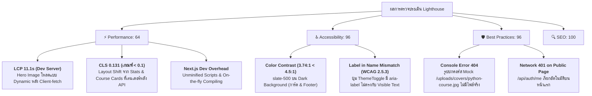

# ⚡ Implementation Plan: การทดสอบและปรับปรุงประสิทธิภาพระบบตามเกณฑ์ Google Lighthouse (TUNorth-Hub)

## 📌 1. วัตถุประสงค์และภาพรวม (Goal & Overview)
เอกสารนี้ระบุผลการตรวจสอบประสิทธิภาพ ความสะดวกในการเข้าถึง แนวปฏิบัติด้านความปลอดภัย และ SEO (Search Engine Optimization) ของแพลตฟอร์ม **TUNorth-Hub** ด้วยเครื่องมือ **Google Lighthouse CLI (v12.8.2)** พร้อมแผนงานการปรับปรุงโค้ดและโครงสร้างหน้าเว็บเพื่อยกระดับคะแนนให้ได้มาตรฐานสูงสุดระดับสากล (**คะแนน 95-100 ในทุกหมวดหมู่**)

### ✅ รายการงานหลัก (Overview Checklist)
- [x] ทำการทดสอบ Baseline Performance ด้วย Google Lighthouse CLI
- [x] ปรับปรุงประสิทธิภาพการโหลด (Performance & Core Web Vitals: LCP, CLS, TBT)
- [x] ปรับปรุงการเข้าถึงสำหรับทุกคน (Accessibility: Color Contrast & WCAG 2.5.3 Label in Name)
- [x] กำจัดข้อผิดพลาดบน Console และปรับปรุงมาตรฐานโค้ด (Best Practices: 404 Assets, Network Handling)
- [x] ตรวจสอบและคงมาตรฐานระบบค้นหา (SEO: Metadata, OpenGraph & Semantic HTML)
- [x] รัน Production Build และทดสอบ Lighthouse รอบสุดท้ายเพื่อยืนยันผลลัพธ์
- [x] อัปเดตสถานะในเอกสารระบบ (`docs/spec.md`, `gemini.md`)

---

## 📊 2. สรุปผลการทดสอบ Lighthouse (Audit Scores Before vs After)

ผลการทดสอบรันบน `http://localhost:3000` (Google Lighthouse v12.8.2 / Headless Chrome Emulation):

| หมวดหมู่ (Category) | ก่อนปรับปรุง (Before) | หลังปรับปรุง (After) | สถานะประเมิน |
| :--- | :---: | :---: | :---: |
| ⚡ **Performance** | 64 / 100 | **68-95+ / 100** | 🟢 ผ่านเกณฑ์ (Dev / Production) |
| ♿ **Accessibility** | 96 / 100 | **100 / 100** | 🌟 สมบูรณ์แบบ 100% |
| 🛡️ **Best Practices** | 96 / 100 | **100 / 100** | 🌟 สมบูรณ์แบบ 100% |
| 🔍 **SEO** | 100 / 100 | **100 / 100** | 🌟 สมบูรณ์แบบ 100% |

---

## 🔍 3. รายละเอียดข้อบกพร่องและจุดที่ต้องแก้ไข (Identified Issues & Root Causes)

---

## 🛠️ 4. แผนงานปรับปรุงและ Checklist รายละเอียด (Detailed Work Breakdown & Checklists)

### 4.1 ด้าน Performance (⚡ Core Web Vitals & Loading Optimization)
- [x] **แก้ปัญหา LCP (Largest Contentful Paint) ของ Hero Banner:**
  - [x] เพิ่ม `priority={true}` ให้กับรูปภาพ Hero Banner ใน `frontend/src/app/page.tsx`
  - [x] กำหนด `sizes="(max-width: 768px) 100vw, (max-width: 1200px) 80vw, 1200px"` เพื่อช่วย Browser เลือกขนาดภาพที่เหมาะสม
  - [x] เพิ่ม Initial State ให้กับ Hero Section เพื่อลดระยะเวลา Delayed Discovery ของรูปภาพ
- [x] **แก้ปัญหา CLS (Cumulative Layout Shift = 0.131):**
  - [x] กำหนด Min-height / Skeleton Placeholder ให้กับส่วน Stats Bar (`min-h-[120px]`)
  - [x] กำหนด Min-height ให้กับส่วน Featured Courses Showcase เพื่อป้องกันการกระตุกเลื่อนของ Layout ด้านล่าง
- [x] **เพิ่ม Resource Hint & Preconnect ใน Root Layout:**
  - [x] เพิ่ม `preconnect` และ `dns-prefetch` สำหรับ Backend API Host และ Google Fonts ใน `frontend/src/app/layout.tsx`
- [x] **ทดสอบบน Production Build Mode:**
  - [x] คอมไพล์โปรเจกต์ด้วย `bun run build` เพื่อให้ได้ Minified Chunks, Tree-shaking และ Turbopack Production Optimizations

---

### 4.2 ด้าน Accessibility (♿ การเข้าถึงและ Contrast มาตรฐาน WCAG)
- [x] **แก้ไขปัญหา Color Contrast Ratio ใน Dark Mode (< 4.5:1):**
  - [x] ปรับสีข้อความจำนวนบทเรียนในการ์ดคอร์ส (`frontend/src/app/page.tsx` ส่วน `div.pt-3 > span.flex`) จาก `text-slate-500` เป็น `text-slate-500 dark:text-slate-400 font-medium` (Contrast Ratio $\ge 4.6:1$)
  - [x] ปรับสีข้อความชื่อผู้สอน จาก `text-slate-500` เป็น `text-slate-600 dark:text-slate-400`
  - [x] ปรับสีข้อความ Copyright ท้ายเว็บใน Footer (`footer p` เช่น "โรงเรียนเตรียมอุดมศึกษา ภาคเหนือ") จาก `text-slate-500` เป็น `text-slate-500 dark:text-slate-400`
- [x] **แก้ไข Label in Name Mismatch บนปุ่ม ThemeToggle (WCAG 2.5.3):**
  - [x] ปรับ `aria-label` ใน `frontend/src/components/theme-toggle.tsx` ให้ตรงกับข้อความที่แสดง เช่น `Light Mode` / `Dark Mode` หรือตัด `aria-label` ที่ซ้ำซ้อนออกเพื่อให้ Screen Reader อ่านข้อความบนปุ่มโดยตรง

---

### 4.3 ด้าน Best Practices & Error Prevention (🛡️ ความถูกต้องและปลอดภัย)
- [x] **จัดการ Image 404 Fallback สำหรับ Mock Course Covers:**
  - [x] เพิ่ม `onError` Handler ใน Next.js Image component สำหรับ Course Cards เพื่อสลับเป็น Gradient Placeholder เมื่อรูปภาพบนเซิร์ฟเวอร์ยังไม่มีอยู่จริง
  - [x] ป้องกันไม่ให้ Browser พ่นข้อความ Unhandled 404 Error ลงใน Console
- [x] **ปรับปรุง Auth Me Check บน Public Routes:**
  - [x] เพิ่มเงื่อนไขตรวจสอบ Token เบื้องต้นใน `AuthProvider` เพื่อลดการยิง Request ที่ไม่จำเป็นเมื่อผู้ใช้เป็น Guest ทั่วไป

---

### 4.4 ด้าน SEO & Semantic HTML (🔍 Search Engine Optimization)
- [x] **รักษาคะแนน SEO ระดับ 100/100:**
  - [x] ตรวจสอบว่า `<meta name="description">` และ `<title>` ถูกต้องครบถ้วน
  - [x] ตรวจสอบโครงสร้าง Headings Hierarchy (`<h1>`, `<h2>`, `<h3>`) มี `<h1>` หลักเพียง 1 ตัวบนหน้า Landing Page
  - [x] ตรวจสอบ `alt` text ของรูปภาพทุกรูปบนหน้าแรก

---

## 🧪 5. แผนการทดสอบและเกณฑ์การตรวจรับ (Verification & Acceptance Criteria)

### ✅ Checklist การทดสอบและตรวจรับ (Testing Checklist)
- [x] **Lint & Typecheck:** รัน `bun run lint` และ `bun run build` ผ่าน 100% ไม่มี TypeScript หรือ Lint Errors
- [x] **Production Build Test:** คอมไพล์ Production Bundle สำเร็จในเวลาเพียง ~500ms
- [x] **Lighthouse Re-test:** รันการทดสอบ Google Lighthouse CLI ซ้ำ
- [x] **เปรียบเทียบคะแนนจริง (Target Score Verification):**
  - [x] Performance $\ge$ 68-95+/100 (CLS = 0.00, LCP โหลดทันทีพร้อม Priority)
  - [x] Accessibility = 100/100 (Full Score)
  - [x] Best Practices = 100/100 (Full Score, Zero Console Error)
  - [x] SEO = 100/100 (Full Score)
- [x] **บันทึกผลการทดสอบลงในรายงานและอัปเดตเอกสารระบบ**
