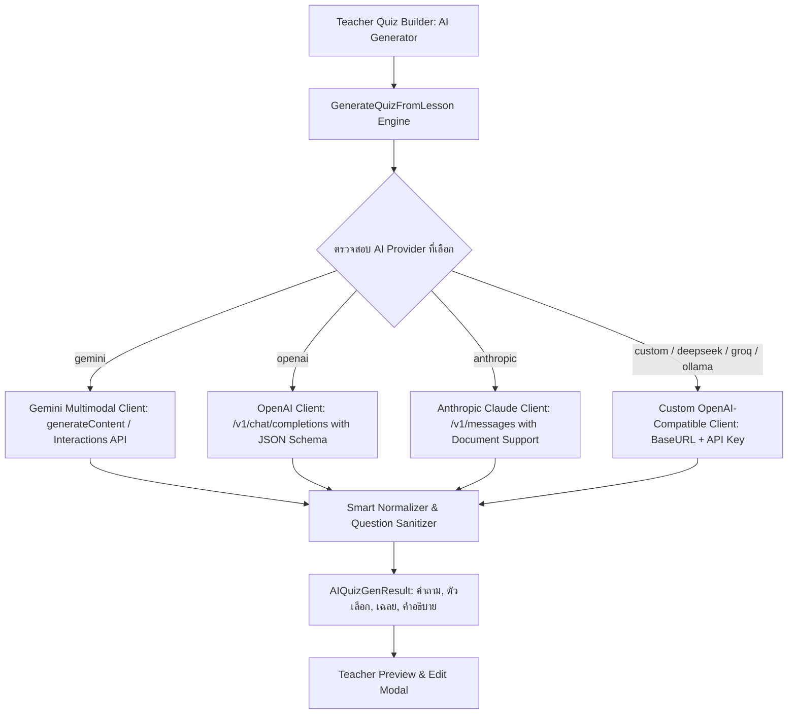

# แผนการพัฒนาระบบ Multi-AI Provider (Google Gemini, OpenAI, Anthropic Claude & Custom Providers)

## 1. วัตถุประสงค์ (Objective)

ยกระดับระบบ **AI Quiz Generation Engine** ให้สามารถเลือกและสลับผู้ให้บริการ AI (AI Provider) ได้หลากหลายตามความต้องการและงบประมาณของสถานศึกษา ได้แก่:
1. **Google Gemini** (Gemini 3.6 Flash, 2.5 Flash Lite, 3.6 Pro)
2. **OpenAI** (GPT-4o, GPT-4o Mini, GPT-4 Turbo, o3-mini)
3. **Anthropic Claude** (Claude 3.5 Sonnet, Claude 3.5 Haiku, Claude 3 Opus)
4. **OpenAI-Compatible & Custom Providers** (DeepSeek V3/R1, Groq Llama-3.3, OpenRouter, Mistral, Ollama / On-Premise Local LLM)

---

## 2. สถาปัตยกรรมระบบ Multi-AI Engine (Architecture Diagram)

---

## 3. รายละเอียดการออกแบบการจัดเก็บข้อมูล (Data & Settings Schema)

ตาราง `system_settings` จะรองรับคีย์การตั้งค่าใหม่ดังนี้:
| Setting Key | Default Value | คำอธิบาย |
| :--- | :--- | :--- |
| `ai_enabled` | `"true"` | เปิด/ปิดการใช้งานระบบ AI ทั่วทั้งแพลตฟอร์ม |
| `ai_provider` | `"gemini"` | ผู้ให้บริการหลัก (`gemini`, `openai`, `anthropic`, `custom`) |
| `ai_default_model`| `"gemini-3.6-flash"` | โมเดลเริ่มต้น |
| `ai_gemini_api_key`| `""` | Google Gemini API Key |
| `ai_openai_api_key`| `""` | OpenAI API Key |
| `ai_anthropic_api_key` | `""` | Anthropic Claude API Key |
| `ai_custom_api_key` | `""` | API Key สำหรับ Custom / DeepSeek / Groq / OpenRouter |
| `ai_custom_base_url` | `"https://api.deepseek.com/v1"` | Base URL ของ Custom Provider หรือ Ollama (`http://localhost:11434/v1`) |

---

## 4. รายการเช็กลิสต์การพัฒนาแบ่งตามหมวดหมู่ (Implementation Checklists)

### 📌 หมวดที่ 1: Backend Multi-Provider Engine (`ai_quiz_generator.go`)
- [x] 1.1 **สร้าง Interface และ Router สำหรับ AI Providers:**
  - `callGeminiMultimodalAPI` (รองรับ Google Gemini)
  - `callOpenAIChatAPI` (รองรับ OpenAI GPT-4o, GPT-4o Mini พร้อม `response_format: json_object`)
  - `callAnthropicMessagesAPI` (รองรับ Claude 3.5 Sonnet / Haiku พร้อมโครงสร้าง System Prompt และ PDF Document Block)
  - `callOpenAICompatibleAPI` (รองรับ Custom BaseURL เช่น DeepSeek, Groq, OpenRouter, Local Ollama)
- [x] 1.2 **Unified System Prompt & JSON Normalizer:**
  - ออกแบบ Prompt ให้ได้โครงสร้าง JSON `{ "quiz_title": "...", "questions": [...] }` เหมือนกันทุก Provider
  - รองรับ Fallback และดึงคำตอบที่ถูกต้องจากทุก Provider อย่างแม่นยำ

### 📌 หมวดที่ 2: Admin Settings & Test Connection API (`settings.go` & `database.go`)
- [x] 2.1 เพิ่มค่าเริ่มต้นใน `database.go` สำหรับ OpenAI, Anthropic, Custom Provider keys
- [x] 2.2 ปรับปรุง `TestAIConnection` Handler ใน `settings.go`:
  - ทดสอบเชื่อมต่อแยกตาม `provider` ที่ส่งมาในคำขอ (`gemini`, `openai`, `anthropic`, `custom`)
  - ส่งข้อความ Ping เพื่อทดสอบความถูกต้องของ API Key, URL, และ Model พร้อมจับเวลา Latency (ms)

### 📌 หมวดที่ 3: Admin Settings UI (`frontend/src/app/admin/settings/page.tsx`)
- [x] 3.1 เพิ่มตัวเลือก AI Provider แบบ Tab / Dropdown สวยงาม:
  - 🔵 **Google Gemini** (Gemini 3.6 Flash, 2.5 Flash Lite, 3.6 Pro)
  - 🟢 **OpenAI** (GPT-4o, GPT-4o Mini, o3-mini)
  - 🟣 **Anthropic Claude** (Claude 3.5 Sonnet, Claude 3.5 Haiku)
  - 🟠 **Custom / DeepSeek / Groq / Ollama** (ระบุ Base URL และ Model Name เองได้อิสระ)
- [x] 3.2 ช่องกรอก API Key และ Base URL แยกตาม Provider พร้อมปุ่มลิงก์ขอรับ API Key
- [x] 3.3 ปุ่ม **"ทดสอบการเชื่อมต่อ (Test Connection)"** แบบ Reactive แสดงผล Latency และสถานะ Real-time

### 📌 หมวดที่ 4: Quiz Builder Modal Updates (`quiz-builder-modal.tsx`)
- [x] 4.1 แสดง Badge ระบุ Provider และ Model ที่ระบบกำลังใช้งานอยู่ปัจจุบัน
- [x] 4.2 จัดการ Error Message ให้แสดงอย่างละเอียดหาก Provider ใดเกิดข้อผิดพลาด

### 📌 หมวดที่ 5: การตรวจสอบและการทดสอบ (Verification & Testing)
- [x] 5.1 ทดสอบระบบ Unit Test สำหรับ Provider Parsers ทั้งหมด
- [x] 5.2 ทดสอบการบันทึกการตั้งค่าและทดสอบการเชื่อมต่อทั้ง 4 รูปแบบ
- [x] 5.3 รัน `go test -v ./...` และ `bun run build` ผ่านการทดสอบ 100% (0 Errors)
