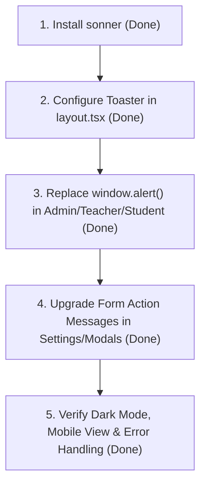

# แผนการเปลี่ยนผ่านระบบแจ้งเตือน (Notifications / Alerts) เป็น Sonner Toast

เอกสารนี้ระบุการวิเคราะห์ผลกระทบ (Impact Analysis) ความเข้ากันได้ของระบบ และขั้นตอนการนำไลบรารี **`sonner`** มาใช้งานแทนที่ระบบแจ้งเตือนแบบเดิม (เช่น Browser `alert()`, Static alert boxes, Message state banners) ในระบบ TUNorth-Hub

---

## 1. การวิเคราะห์ผลกระทบ (Impact Analysis)

### 1.1 ความเข้ากันได้ทางเทคนิค (Technical Compatibility)

| รายการ | สถานะปัจจุบัน | ความเข้ากันได้กับ Sonner | ผลกระทบ |
| :--- | :--- | :--- | :--- |
| **Framework & Engine** | Next.js 16.3.1 (App Router) | รองรับ 100% | ไม่มีผลกระทบเชิงลบ ติดตั้ง `<Toaster />` ใน Root Layout ได้ทันที |
| **React Version** | React 19.2.8 | รองรับ React 19 | ไม่มีปัญหาเรื่อง peer dependencies |
| **Styling** | Tailwind CSS v4 | รองรับ (`richColors`, Tailwind class overrides) | สามารถปรับแต่งธีมให้ตรงกับ Brand Token ได้ง่าย |
| **Theme / Dark Mode** | `ThemeProvider` (class-based `dark`) | รองรับ auto detection หรือผ่าน context | Toast จะปรับโหมดมืด-สว่างตามธีมเว็บโดยอัตโนมัติ |
| **Backend / APIs** | Go Fiber API | ไม่มีการเปลี่ยนแปลง | ปลอดภัย ไม่กระทบ Backend API ใดๆ |
| **Package Size** | - | น้ำหนักเบามาก (~3-4 KB gzipped) | ไม่กระทบความเร็วในการโหลดหน้าเว็บ (Zero performance penalty) |

---

### 1.2 ข้อดีที่จะได้รับ (Benefits)

1. **User Experience (UX) ทันสมัย ไหลลื่น**:
   - ยกเลิกการใช้ Native Browser `alert()` ที่บล็อกการทำงานของเบราว์เซอร์ (Thread-blocking popup)
   - แจ้งเตือนสวยงาม มีไอคอน (Success, Error, Warning, Info, Loading) และแอนิเมชัน Smooth Micro-interactions
2. **การแยกและปรับแต่งเวลาแสดงผลตามประเภท (Customized Durations)**:
   - **`toast.success`**: 3 วินาที (3,000 ms) กระชับ ไม่เกะกะสายตา
   - **`toast.error`**: 5 วินาที (5,000 ms) นานพอให้ผู้ใช้อ่านรายละเอียดและสาเหตุข้อผิดพลาดได้ครบถ้วน
   - **`toast.warning`**: 4 วินาที (4,000 ms)
   - **`toast.info`**: 3 วินาที (3,000 ms)
3. **การแจ้งเตือนแบบ Async / Promise Toasts**:
   - รองรับ `toast.promise()` สำหรับการอัปโหลดไฟล์วิดีโอ/PDF, การลบข้อมูล หรือการบันทึกการตั้งค่าขนาดใหญ่ แสดงสถานะ Loading -> Success/Error ได้ใน toast เดียว
4. **ลดโค้ดส่วนเกินในหน้าเว็บ (Cleaner Codebase)**:
   - ไม่ต้องสร้าง `useState("")` สำหรับ `errorMessage` / `successMessage` และกล่องข้อความสีแดง/เขียวซ้ำซ้อนในทุก Component
5. **Action Toasts & Dismissal**:
   - สามารถใส่ปุ่ม Action เช่น "ลองใหม่อีกครั้ง" หรือ "ยกเลิก" และสามารถกดปิดหรือเลื่อนปัดทิ้ง (Swipe to dismiss) ได้

---

### 1.3 สิ่งที่ต้องพิจารณา / ข้อควรระวัง (Key Considerations)

> [!NOTE]
> **ความแตกต่างระหว่าง "แถบประกาศระบบ (Announcement Banner)" และ "Toast Notification"**
> - **แถบประกาศระบบ (`AnnouncementBanner`)**: เหมาะสำหรับข้อความคงที่จากแอดมิน (เช่น "ระบบจะปิดปรับปรุงเวลา 22:00 น.") ซึ่งควรตรึงอยู่บนสุดของจอเพื่อให้ผู้ใช้เห็นตลอดเวลาจนกว่าจะกดปิด
> - **Toast Notification (`sonner`)**: เหมาะสำหรับการแจ้งผลลัพธ์ของการกระทำ (Action feedback) เช่น บันทึกสำเร็จ, ลบสำเร็จ, อัปโหลดล้มเหลว, คัดลอกลิงก์สำเร็จ, แจ้งเตือนข้อผิดพลาด
> 
> **ข้อเสนอแนะ**: ควรคง `AnnouncementBanner` ไว้สำหรับประกาศระดับโรงเรียน/ระบบ และเปลี่ยนแจ้งเตือนประเภท Feedback ทั้งหมดในระบบเป็น Sonner Toast

> [!WARNING]
> **Form Field Validation Errors**
> ในหน้า Register/Login กล่องข้อความแจ้งเตือนสีแดงเฉพาะจุด (Inline Field Error) ใต้ช่องกรอกยังควรมีไว้ หรือจะยิง Toast คู่กัน เพื่อความสะดวกต่อผู้ใช้ที่ใช้งานบนหน้าจอมือถือ

---

## 2. ขอบเขตการปรับเปลี่ยนในระบบ (Scope of Changes)

### จุดที่ 1: การติดตั้ง Toaster Provider
- [x] ติดตั้ง `sonner` package
- [x] เพิ่มคอมโพเนนต์ `<Toaster richColors position="top-right" closeButton />` ภายใน [RootLayout](file:///D:/Hub/frontend/src/app/layout.tsx)

### จุดที่ 2: เปลี่ยน Native Browser `alert(...)`
- [x] [admin/page.tsx](file:///D:/Hub/frontend/src/app/admin/page.tsx): การลบผู้ใช้งาน, สร้าง/แก้ไขผู้ใช้, นำเข้าไฟล์ (`toast.success` / `toast.error`)
- [x] [teacher/page.tsx](file:///D:/Hub/frontend/src/app/teacher/page.tsx): การสร้างรายวิชา, สลับสถานะเผยแพร่, การลบรายวิชา (`toast.success` / `toast.error`)
- [x] [student/page.tsx](file:///D:/Hub/frontend/src/app/student/page.tsx): การดึงใบประกาศนียบัตร, การลงทะเบียนเรียน (`toast.success` / `toast.error`)
- [x] [student/courses/[id]/page.tsx](file:///D:/Hub/frontend/src/app/student/courses/[id]/page.tsx): การดึงใบประกาศนียบัตร (`toast.error`)
- [x] [assignment-panel.tsx](file:///D:/Hub/frontend/src/components/assignment-panel.tsx): แจ้งเตือนกรอกคำตอบ/อัปโหลดไฟล์ และการส่งการบ้าน (`toast.success` / `toast.error`)

### จุดที่ 3: ปรับเปลี่ยน Action Message Banners ในหน้าจัดการ
- [x] [admin/settings/page.tsx](file:///D:/Hub/frontend/src/app/admin/settings/page.tsx): บันทึกการตั้งค่าสำเร็จ (`toast.success`), อัปโหลดโลโก้/Favicon/Hero สำเร็จหรือผิดพลาด (`toast.error`)
- [x] [quiz-builder-modal.tsx](file:///D:/Hub/frontend/src/components/quiz-builder-modal.tsx): แจ้งเตือนบันทึกข้อสอบ / บันทึกเฉลยสำเร็จ / ลบข้อสอบ (`toast.success` / `toast.error`)
- [x] [assignment-builder-modal.tsx](file:///D:/Hub/frontend/src/components/assignment-builder-modal.tsx): แจ้งเตือนบันทึกการบ้าน / ตรวจการบ้าน / ลบการบ้าน (`toast.success` / `toast.error`)
- [x] [file-uploader.tsx](file:///D:/Hub/frontend/src/components/file-uploader.tsx): แจ้งเตือนความคืบหน้าการอัปโหลดไฟล์ (`toast.success` / `toast.error`)

---

## 3. แผนการดำเนินงาน (Proposed Steps)

### ขั้นตอนที่ 1: ติดตั้ง Dependency (เสร็จสิ้น)
- [x] `bun add sonner`

### ขั้นตอนที่ 2: ปรับปรุง [layout.tsx](file:///D:/Hub/frontend/src/app/layout.tsx) (เสร็จสิ้น)
- [x] กำหนด `<AppToaster />` เชื่อมต่อสถานะ Dark / Light Mode แบบ Reactive

### ขั้นตอนที่ 3: ปรับปรุงหน้าต่างๆ ที่เคยใช้ `alert()` (เสร็จสิ้น)
- [x] เปลี่ยน `alert()` ทั้งหมดในระบบเป็น `toast.success` และ `toast.error`

### ขั้นตอนที่ 4: ปรับปรุง Action Message Banners ในหน้า Settings & Modals (เสร็จสิ้น)
- [x] ปรับปรุงหน้า Admin Settings, Quiz Builder Modal, Assignment Builder Modal, File Uploader

---

## 4. แผนการทดสอบ (Verification Plan)

### การทดสอบด้วยตนเอง (Manual Testing):
1. **การแสดงผลและการจัดวาง (Layout & Positioning)**: ตรวจสอบว่า Toast ปรากฏที่มุมบนขวา ไม่ทับซ้อนกับ Navbar หรือ AnnouncementBanner
2. **ธีมโหมดมืด-สว่าง (Dark & Light Theme)**: สลับ Theme แล้วตรวจสอบว่าสไตล์ของ Toast ปรับสีพื้นหลัง/ข้อความถูกต้อง
3. **การทำงานของปุ่ม Action & ปิด Toast (Close Button & Dismiss)**: กดปุ่มกากบาทหรือรอตามระยะเวลา (Auto dismiss)
4. **ทดสอบ Trigger แต่ละบทบาท**:
   - แอดมิน: บันทึกการตั้งค่า, ลบผู้ใช้
   - ครู: สร้างรายวิชา, ลบรายวิชา, เพิ่มข้อสอบ/การบ้าน
   - นักเรียน: ส่งการบ้าน, ดาวน์โหลด/ดูใบประกาศนียบัตร
