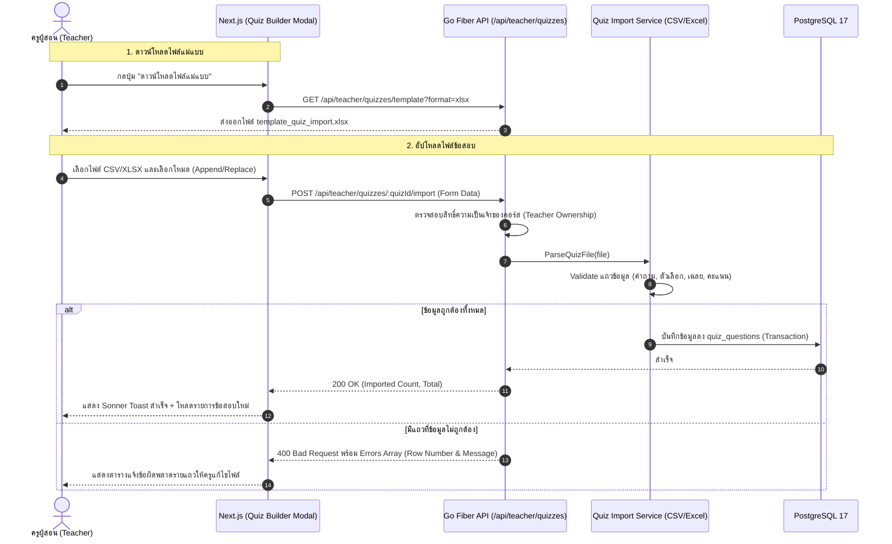

# 📋 แผนการพัฒนา: ระบบนำเข้าแบบทดสอบ (Quiz & Question Import Engine)

เอกสารฉบับนี้วิเคราะห์ผลกระทบต่อระบบ นำเสนอรูปแบบไฟล์แม่แบบ (Template Specification), กฎการตรวจสอบความถูกต้อง (Validation Matrix), สถาปัตยกรรม API และระบุรายการงานย่อย (Implementation Checklist) สำหรับการพัฒนาระบบนำเข้าข้อสอบจากไฟล์ CSV และ Excel (.xlsx) ในแพลตฟอร์ม **TUNorth-Hub**

---

## 1. บทนำและวัตถุประสงค์ (Overview & Objectives)

ระบบนำเข้าแบบทดสอบ (Quiz Import Engine) ออกแบบมาเพื่อเพิ่มความสะดวกและลดภาระงานของครูผู้สอนในการสร้างข้อสอบจำนวนมากในแต่ละบทเรียน โดยมีเป้าหมายหลักคือ:
1. **ความยืดหยุ่นในการจัดเตรียมข้อมูล (File Format Flexibility):** รองรับทั้งไฟล์ **CSV (UTF-8)** และ **Excel (.xlsx)** ที่ครูคุ้นเคยจาก Microsoft Excel หรือ Google Sheets
2. **การนำเข้า 2 โหมดการทำงาน (Append & Replace Modes):** 
   - **Append Mode (เพิ่มต่อท้าย):** นำเข้าข้อสอบใหม่เพิ่มเข้าไปในแบบทดสอบเดิมโดยไม่ลบข้อสอบที่มีอยู่
   - **Replace Mode (แทนที่ทั้งหมด):** ล้างข้อสอบเดิมในแบบทดสอบนั้นออกทั้งหมด แล้วใส่ชุดข้อสอบใหม่จากไฟล์
3. **การตรวจสอบความถูกต้องอย่างเข้มงวด (Data Integrity & Validation Engine):** ตรวจสอบโจทย์ ตัวเลือก เฉลย และคะแนนล่วงหน้า พร้อมรายงานข้อผิดพลาดระบุเลขแถว (Row-level Error Diagnostics) ชัดเจน
4. **ความปลอดภัยและการแยกสิทธิ์ (RBAC & Ownership Security):** ครูผู้สอนสามารถนำเข้าข้อสอบได้เฉพาะในคอร์สที่ตนเองเป็นเจ้าของเท่านั้น ส่วน Admin สามารถนำเข้าได้ทุกคอร์ส

---

## 2. การวิเคราะห์ผลกระทบต่อระบบ (System Impact Analysis)

| มิติ / ส่วนประกอบ (Component) | ระดับผลกระทบ | รายละเอียดผลกระทบและแนวทางรับมือ |
| :--- | :---: | :--- |
| **1. ฐานข้อมูล (Database Schema)** | **ไม่มีผลกระทบ (0% Breaking)** | ตาราง `quizzes` และ `quiz_questions` มีโครงสร้างรองรับประเภทคำถาม (`MULTIPLE_CHOICE`, `TRUE_FALSE`), `options_json`, `correct_answer`, `points` อยู่แล้ว ไม่ต้อง Migrate ตารางใหม่ |
| **2. ระบบตรวจคะแนน (Grading & Quiz Engine)** | **ไม่มีผลกระทบ (0% Breaking)** | ระบบตรวจข้อสอบฝั่งนักเรียน (`POST /api/student/quizzes/:id/submit`) ใช้ฟิลด์ของ `QuizQuestion` เดิมตามปกติ 100% จึงคำนวณและบันทึกคะแนนประวัติสอบได้แม่นยำ |
| **3. API เดิมของระบบ (Existing APIs)** | **ไม่มีผลกระทบ (0% Breaking)** | API การสร้าง/แก้ไข/ลบข้อสอบรายข้อ (`POST /api/teacher/quizzes/:quizId/questions`, `PUT`, `DELETE`) ยังทำงานได้ตามปกติ ระบบ Import เป็นเพียง Endpoint เสริมแบบ Non-destructive |
| **4. สิทธิ์และการควบคุมความปลอดภัย (RBAC & Security)** | **ควบคุมได้รัดกุม** | มีระบบตรวจสอบความเป็นเจ้าของคอร์ส (Course Ownership Guard) เพื่อให้แน่ใจว่าครูสามารถ Import ข้อสอบได้เฉพาะในคอร์สวิชาที่ตนเองรับผิดชอบเท่านั้น (Admin เข้าถึงได้ทุกวิชา) |
| **5. ประสบการณ์ผู้ใช้ (UX/UI)** | **เชิงบวก (High Positive Impact)** | ครูผู้สอนไม่ต้องพิมพ์ข้อสอบทีละข้อในหน้าเว็บ สามารถจัดเตรียมข้อสอบ 20–100 ข้อใน Excel แล้วอัปโหลดเข้าสู่ระบบได้ในคลิกเดียว พร้อมมีไฟล์แม่แบบ (Template) ให้ดาวน์โหลด |

---

## 3. สถาปัตยกรรมและกระบวนการทำงาน (Architecture & Workflow)

### 3.1 ลำดับขั้นตอนการนำเข้าข้อสอบ (Sequence Workflow)



---

## 4. โครงสร้างไฟล์แม่แบบและกฎการตรวจสอบ (Template & Validation Specification)

### 4.1 ตารางคอลัมน์มาตรฐาน (Standard Columns)

| คอลัมน์ (TH / EN) | ชนิดข้อมูล | จำเป็น | ตัวอย่างค่า | คำอธิบาย |
| :--- | :---: | :---: | :--- | :--- |
| `ข้อที่ / no` | ตัวเลข/ข้อความ | ไม่บังคับ | `1`, `2`, `3` | ลำดับข้อสำหรับอ้างอิง |
| `คำถาม / question` | ข้อความ | **จำเป็น** | `ภาษาโปรแกรมใดใช้พัฒนาเว็บฝั่งเซิร์ฟเวอร์?` | เนื้อหาโจทย์ข้อสอบ |
| `ประเภท / type` | ข้อความ | ไม่บังคับ | `MULTIPLE_CHOICE` หรือ `TRUE_FALSE` | ปรนัย หรือ ถูก/ผิด (Default: `MULTIPLE_CHOICE`) |
| `ตัวเลือก 1 / option_a` | ข้อความ | **จำเป็น (ปรนัย)** | `Python` หรือ `จริง` | ตัวเลือก ก / A (หากเป็น TRUE_FALSE ให้ใส่ จริง/True) |
| `ตัวเลือก 2 / option_b` | ข้อความ | **จำเป็น (ปรนัย)** | `HTML` หรือ `เท็จ` | ตัวเลือก ข / B (หากเป็น TRUE_FALSE ให้ใส่ เท็จ/False) |
| `ตัวเลือก 3 / option_c` | ข้อความ | ทางเลือก | `CSS` | ตัวเลือก ค / C |
| `ตัวเลือก 4 / option_d` | ข้อความ | ทางเลือก | `SQL` | ตัวเลือก ง / D |
| `เฉลย / correct_answer` | ข้อความ | **จำเป็น** | `Python`, `A`, `1`, หรือ `จริง` | ระบุข้อความตรงกับตัวเลือก หรือใส่คีย์ A/B/C/D |
| `คะแนน / points` | ตัวเลขจำนวนเต็ม | ไม่บังคับ | `1`, `2`, `5` | คะแนนประจำข้อ (Default: 1) |

### 4.2 กฎการแปลงและตรวจสอบความถูกต้อง (Validation Rules)
1. **Question Text:** ตัดช่องว่างหัวท้าย (`TrimSpace`) ต้องไม่เป็นค่าว่าง
2. **Options Parsing:**
   - **MULTIPLE_CHOICE:** ต้องมีตัวเลือกอย่างน้อย 2 ตัวเลือกที่ไม่ว่างเปล่า
   - **TRUE_FALSE:** หากไม่ได้ระบุตัวเลือก ระบบจะใส่ตัวเลือกมาตรฐาน `["จริง", "เท็จ"]` ให้อัตโนมัติ
3. **Correct Answer Matching:**
   - รองรับการระบุเฉลยเป็น Index/Key: `A`/`ก`/`1` -> แมปกับ Option A, `B`/`ข`/`2` -> Option B, `C`/`ค`/`3` -> Option C, `D`/`ง`/`4` -> Option D
   - รองรับการระบุข้อความเฉลยตรงกับตัวเลือก เช่น พิมพ์ `Python` ตรงกับตัวเลือก `Python`
   - หากเฉลยไม่ตรงกับตัวเลือกใดๆ จะแจ้ง Error ประจำแถว เช่น `แถวที่ 3: เฉลย 'Java' ไม่ตรงกับตัวเลือกใดๆ`
4. **Points:** ต้องเป็นตัวเลขจำนวนเต็มบวก $\ge 1$ (หากเว้นว่างไว้จะกำหนดเป็น 1 คะแนน)

---

## 5. รายการ API Endpoints (API Specification)

### 5.1 ดาวน์โหลดไฟล์แม่แบบข้อสอบ (Download Template)
* **Method:** `GET`
* **URL:** `/api/teacher/quizzes/template`
* **Query Parameters:** `format=xlsx` หรือ `format=csv` (Default: `xlsx`)
* **Headers:** `Authorization: Bearer <token>` (สิทธิ์ TEACHER หรือ ADMIN)
* **Response:** Binary Stream ไฟล์ `.xlsx` หรือ `.csv` พร้อม Header `Content-Disposition: attachment; filename="quiz_import_template.xlsx"`

### 5.2 นำเข้าชุดข้อสอบ (Batch Import Questions)
* **Method:** `POST`
* **URL:** `/api/teacher/quizzes/:quizId/import`
* **Headers:** `Content-Type: multipart/form-data`, `Authorization: Bearer <token>`
* **Form Data Fields:**
  - `file`: ไฟล์แนบ (.csv หรือ .xlsx ไม่เกิน 10MB)
  - `mode`: `"append"` (ค่าเริ่มต้น) หรือ `"replace"`
* **Response Status Codes:**
  - `200 OK`: นำเข้าสำเร็จครบทุกข้อ
  - `400 Bad Request`: ไฟล์ไม่ถูกต้อง หรือพบแถวที่มีข้อผิดพลาดในการตรวจสอบ
  - `403 Forbidden`: ไม่มีสิทธิ์แก้ไขคอร์สนี้ (ไม่ใช่เจ้าของคอร์ส)
  - `404 Not Found`: ไม่พบรหัสชุดแบบทดสอบ

---

## 6. รายการงานย่อยและเช็กลิสต์การพัฒนา (Implementation Checklists)

### 📌 หมวดที่ 1: สถาปัตยกรรมและการประมวลผลไฟล์ Backend (Go Service & Parser)
- [x] 1.1 สร้างไฟล์ `backend/internal/services/quiz_importer.go` กำหนดโครงสร้าง `RawQuizQuestionRow`, `QuizImportResult`, `QuizImportRowError`
- [x] 1.2 พัฒนาฟังก์ชัน `ParseQuizCSV(r io.Reader) ([]RawQuizQuestionRow, error)` สำหรับอ่านไฟล์ CSV (รองรับ Header ภาษาไทยและภาษาอังกฤษ)
- [x] 1.3 พัฒนาฟังก์ชัน `ParseQuizExcel(r io.Reader) ([]RawQuizQuestionRow, error)` ผ่านแพ็กเกจ `excelize/v2`
- [x] 1.4 พัฒนากลไก Validation และ Normalization สำหรับตัวเลือกและเฉลย (แมป A, B, C, D / ก, ข, ค, ง / 1, 2, 3, 4)
- [x] 1.5 พัฒนาฟังก์ชัน `ProcessBatchQuizImport(db *gorm.DB, quizID uuid.UUID, rawRows []RawQuizQuestionRow, mode string)` รองรับ Database Transaction (Rollback หากเกิดข้อผิดพลาดในโหมด Replace)
- [x] 1.6 พัฒนาฟังก์ชันสร้างไฟล์แม่แบบ `GenerateQuizTemplateXLSX()` และ `GenerateQuizTemplateCSV()` พร้อมใส่ตัวอย่างข้อสอบ 2-3 ข้อ

### 📌 หมวดที่ 2: Handlers & Routes (Backend API Integration)
- [x] 2.1 เพิ่มฟังก์ชัน `ImportQuestions(c *fiber.Ctx) error` ใน `backend/internal/handlers/quizzes.go` พร้อมระบบ Course Ownership Check
- [x] 2.2 เพิ่มฟังก์ชัน `DownloadQuizTemplate(c *fiber.Ctx) error` ใน `backend/internal/handlers/quizzes.go`
- [x] 2.3 ลงทะเบียน Route ใน `backend/internal/routes/routes.go`:
  - `POST /api/teacher/quizzes/:quizId/import`
  - `GET /api/teacher/quizzes/template`
- [x] 2.4 เขียน Unit Test ใน `backend/internal/services/quiz_importer_test.go` ครอบคลุมกรณี CSV, XLSX, Append, Replace และ Error Validation

### 📌 หมวดที่ 3: ส่วนติดต่อผู้ใช้งาน (Frontend Next.js 16 Component)
- [x] 3.1 เพิ่มปุ่ม **"นำเข้าข้อสอบ (Import)"** และปุ่ม **"ดาวน์โหลดแม่แบบ"** ใน [`QuizBuilderModal`](frontend/src/components/quiz-builder-modal.tsx)
- [x] 3.2 สร้าง Modal สำหรับการนำเข้าข้อสอบ (`ImportQuizModal`) รองรับการลากวางไฟล์ (Drag & Drop) และแสดงชื่อ/ขนาดไฟล์ที่เลือก
- [x] 3.3 สร้างตัวเลือกโหมดการนำเข้า: *"เพิ่มต่อท้ายข้อสอบเดิม (Append)"* หรือ *"แทนที่ข้อสอบเดิมทั้งหมด (Replace)"* พร้อมคำเตือน
- [x] 3.4 เชื่อมต่อ API Upload และแสดงสถานะความคืบหน้า (Loading Spinner & Progress)
- [x] 3.5 ออกแบบการ์ดแจ้งเตือนผลลัพธ์ผ่าน Sonner Toast (`toast.success` / `toast.error`) และแสดงตาราง Error List หากมีข้อผิดพลาดระบุแถว
- [x] 3.6 รีเฟรชรายการข้อสอบใน `QuizBuilderModal` อัตโนมัติหลังการนำเข้าสำเร็จ

### 📌 หมวดที่ 4: การตรวจสอบ ทดสอบ และบันทึกเอกสาร (Verification & Documentation)
- [x] 4.1 ทดสอบการ Import ไฟล์ Excel (.xlsx) ที่มีโจทย์ทั้งปรนัยและถูกผิด 20+ ข้อ
- [x] 4.2 ทดสอบการแจ้งเตือน Error เมื่อเฉลยไม่ตรงกับตัวเลือกในแถว
- [x] 4.3 ทดสอบการสลับโหมดระหว่าง Append และ Replace
- [x] 4.4 ตรวจสอบระบบ RBAC ป้องกันครูต่างวิชาไม่ให้ Import ข้ามคอร์ส
- [x] 4.5 ทดสอบการทำแบบทดสอบฝั่งนักเรียน (`QuizPlayer`) ว่าตรวจคะแนนได้ถูกต้องตรงตามเฉลยที่นำเข้า
- [x] 4.6 อัปเดตตาราง API Routes Matrix และ Phase Checklists ใน [`docs/spec.md`](docs/spec.md) และ [`gemini.md`](gemini.md)

---

## 7. แผนการตรวจสอบและทดสอบ (Verification Plan)

### 7.1 Automated Testing
```powershell
# รัน Unit Test สำหรับ Quiz Importer Service
cd D:\Hub\backend
go test -v ./internal/services/quiz_importer_test.go ./internal/services/quiz_importer.go
```

### 7.2 Manual Testing Checklist
1. เข้าสู่ระบบด้วยบัญชีครู (`teacher@tunorth.ac.th`)
2. เปิดหน้าคอร์สและคลิกจัดการแบบทดสอบในบทเรียนใดๆ
3. กดดาวน์โหลดไฟล์แม่แบบ Excel (`.xlsx`)
4. ใส่ข้อมูลข้อสอบตัวอย่าง 5 ข้อ (4 ข้อปรนัย + 1 ข้อถูกผิด) แล้วอัปโหลดด้วยโหมด **Append**
5. ตรวจสอบว่าข้อสอบใหม่ 5 ข้อแสดงผลครบถ้วน
6. ทดลองอัปโหลดไฟล์ที่มีข้อผิดพลาด (เช่น ไม่มีตัวเลือกตรงกับเฉลย) และตรวจสอบว่าระบบปฏิเสธพร้อมระบุเลขแถวถูกต้อง
7. ทดสอบโหมด **Replace** และตรวจสอบว่าข้อสอบเดิมถูกล้างและแทนที่ด้วยชุดใหม่อย่างปลอดภัย
