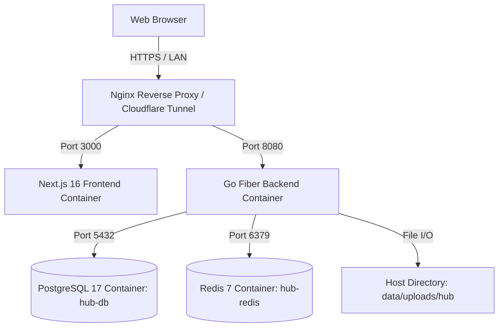

# 🛠️ สรุป Tech Stack ทั้งระบบ (TUNorth-Hub System Architecture & Tech Stack)

เอกสารสรุปสถาปัตยกรรมและเทคโนโลยีที่ใช้ในการพัฒนาระบบ **TUNorth-Hub** (แพลตฟอร์ม LMS ดิจิทัลสำหรับโรงเรียนเตรียมอุดมศึกษา ภาคเหนือ) ครอบคลุมทุกเลเยอร์ของระบบ

---

## 1. 🌐 Frontend Stack (Web Application)

| องค์ประกอบ | เทคโนโลยี / เครื่องมือ | เวอร์ชัน / รายละเอียด | หน้าที่และความสำคัญ |
| :--- | :--- | :--- | :--- |
| **Framework** | **Next.js (App Router)** | `16.3.1` | React Framework สำหรับ Server-Side Rendering (SSR), Client Routing และ Full-stack capabilities |
| **Core UI Library** | **React** / **React DOM** | `19.2.8` | Component-based UI rendering และ State management |
| **Language** | **TypeScript** | `^5.0` | Type-safety, static analysis, Interface contracts |
| **Package Manager** | **Bun** | `1.3.9` | จัดการ dependencies รวดเร็วสูง รันสคริปต์ และทดสอบระบบ (ไม่มี Semicolon styling convention) |
| **Styling & CSS** | **Tailwind CSS** + PostCSS | `v4` (`@tailwindcss/postcss`) | Utility-first CSS engine สำหรับ Theme, Dark/Light Mode และ Responsive Design |
| **Style Utilities** | `clsx`, `tailwind-merge`, `cva` | ล่าสุด | บริหารจัดการ dynamic class names และ component variant styling |
| **Iconography** | **Lucide React** | `^1.31.0` | ไอคอนเวกเตอร์ SVG น้ำหนักเบา สอดคล้องกับธีม |
| **Notification / Toast** | **Sonner** | `^2.0.8` (`@/lib/toast`) | ระบบ Toast Alert ปรับตัวตาม Dark/Light Mode, เลิกใช้ native browser alert ทั้งหมด |
| **Code Editor** | **Monaco Editor** | `^4.7.0` (`@monaco-editor/react`) | Web code editor สำหรับบทเรียน Interactive Code Lab |
| **In-Browser Python Engine**| **Pyodide (WebAssembly)** | `v0.26.2` | รันโค้ด Python 3.12+ ภายในเบราว์เซอร์ของนักเรียนโดยตรง ไม่กินโหลดเซิร์ฟเวอร์ |
| **QR Code Engine** | `qrcode`, `html5-qrcode` | `^1.5.4` / `^2.3.8` | สร้าง Dynamic QR Code สำหรับใบประกาศนียบัตร และสแกน QR ผ่านกล้องเว็บแคม/ไฟล์รูปภาพ |
| **Typography** | **Prompt & Inter** | Google Fonts | ฟอนต์หลักภาษาไทย (Prompt) และภาษาอังกฤษ/ตัวเลข (Inter) |

---

## 2. ⚙️ Backend Stack (API & Services)

| องค์ประกอบ | เทคโนโลยี / เครื่องมือ | เวอร์ชัน / รายละเอียด | หน้าที่และความสำคัญ |
| :--- | :--- | :--- | :--- |
| **Language & Runtime** | **Go (Golang)** | `1.25.5` | ประสิทธิภาพสูง, Concurrency ดีเยี่ยม, Memory footprint ต่ำมาก |
| **Web Framework** | **Fiber** | `v2.52.15` (บน FastHTTP) | REST API Routing, Middleware, High-throughput HTTP Engine |
| **ORM / Data Access** | **GORM** | `v1.31.2` | Data Mapper, Model Migrations, Relations และ Queries |
| **PostgreSQL Driver** | `pgx/v5` / `gorm.io/driver/postgres` | `v5.10.0` / `v1.6.2` | Connection Pooling และ Database wire protocol |
| **In-Memory / Redis Client**| `go-redis/v9` | `v9.22.0` | จัดการ Session, Cache และ Rate limiting |
| **Authentication** | `golang-jwt/jwt/v5` + `bcrypt` | `v5.3.1` / `v0.55.0` | ออกและตรวจสอบ JWT Tokens และ Hash รหัสผ่านผู้ใช้งาน |
| **Spreadsheet Processing** | `excelize/v2` | `v2.11.0` | นำเข้า-ส่งออกข้อสอบ Batch Import (.xlsx, .csv) และ Template Engine |
| **Hot Reload (Dev)** | **Air** | `v1.64+` (`.air.toml`) | Live-reload ฝั่ง Backend อัตโนมัติระหว่างพัฒนา |
| **UUID Generator** | `google/uuid` | `v1.6.0` | สร้าง Primary Key ชนิด UUIDv4 |

---

## 3. 🧠 AI & Intelligent Services

| บริการ / ฟีเจอร์ | ผู้ให้บริการ / เทคโนโลยี | รายละเอียดการทำงาน |
| :--- | :--- | :--- |
| **AI Quiz Generation Engine** | **Google Gemini API** / Multi-Provider AI (OpenAI, Claude-compatible) | วิเคราะห์เนื้อหาบทเรียนและสร้างข้อสอบปรนัย 4 ตัวเลือกอัตโนมัติพร้อมเฉลย |
| **Content Grounding** | Text Extraction & Custom Prompt Guard | ป้องกัน AI Hallucination โดยบังคับให้ออกข้อสอบอิงจากเนื้อหาบทเรียน/สไลด์ที่กำหนดเท่านั้น |

---

## 4. 🗄️ Database, Caching & Storage

* **Database:** **PostgreSQL 17** (Database: `tunorth_hub`, คอนเทนเนอร์ `hub-db`) เก็บ Entity ผู้ใช้ คอร์ส บทเรียน แบบทดสอบ การส่งงาน และใบประกาศนียบัตร
* **Cache & Memory Store:** **Redis 7** (คอนเทนเนอร์ `hub-redis`) สำหรับ Cache ข้อมูลสถิติ, Token Blacklist, Dynamic Settings
* **Storage:** **Local Volume Mount** (`/var/tunorth_data/uploads` แมปไปยัง Host Server: `../../data/uploads/hub`) รองรับไฟล์วิดีโอ (MP4/WebM), PDF สไลด์, รูปปกคอร์ส, Avatar และไฟล์ส่งการบ้าน

---

## 5. 🚢 DevOps, Network & Infrastructure

| ส่วนประกอบ | รายละเอียดสถาปัตยกรรม |
| :--- | :--- |
| **Container Engine** | **Docker & Docker Compose** (โครงสร้าง Multi-container แยก Service ชัดเจน) |
| **Internal Network** | Docker Network `tunorth-net` (External Bridge แชร์ร่วมกับระบบโรงเรียน) |
| **Reverse Proxy** | **Local Nginx** บน Server (Port 8008, LAN Portal Port 80, `client_max_body_size 500M`) |
| **Public Domain & SSL** | **Cloudflare Tunnel** (`hub.tn.ac.th`) แบบ Zero Trust / End-to-End SSL |
| **Target Server Host** | On-Premise **HP ProLiant ML350 G6** ติดตั้ง **Ubuntu Server 24.04 LTS** |
| **Data Backup** | Automated Daily CronJob Backup สำหรับ PostgreSQL Dump และ Media Uploads |

---

## 6. 🔐 สรุปการแบ่งสิทธิ์ผู้ใช้งาน (RBAC Policy)

* 👨‍💼 **ADMIN:** เข้าถึง `/admin`, `/admin/categories`, `/admin/landing`, `/admin/settings`, `/profile`
* 👩‍🏫 **TEACHER:** เข้าถึง `/teacher`, จัดการคอร์ส/บทเรียน/ข้อสอบ/ตรวจงาน, `/profile`
* 🧑‍🎓 **STUDENT:** เข้าถึง `/student`, เรียนเนื้อหา, ทำข้อสอบ, เขียนโค้ดใน Code Lab, ส่งการบ้าน, รับเกียรติบัตร, `/profile`
* 🌍 **PUBLIC / GUEST:** หน้าแรก (`/`), เข้าสู่ระบบ (`/login`), สมัครเรียน (`/register`), ตรวจสอบใบประกาศนียบัตร (`/verify`, `/verify/[code]`)
